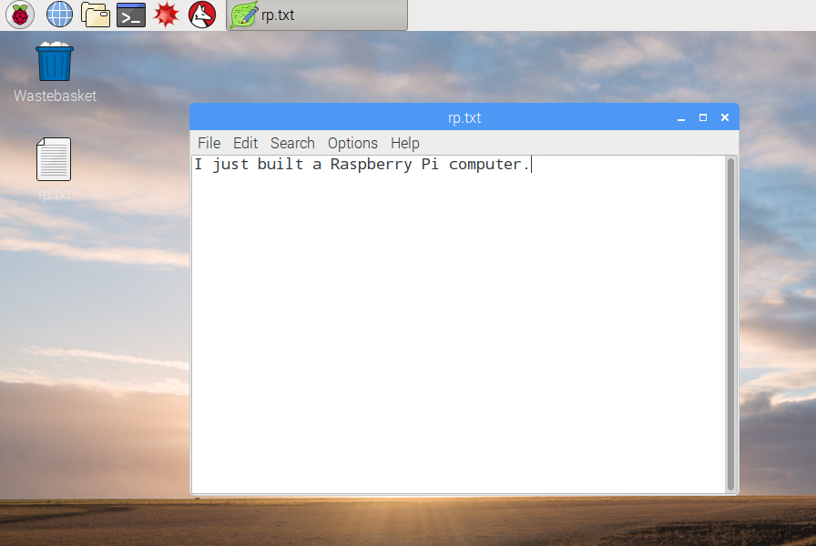

## রাস্পবেরী পাই এর একটি সফর

এখন রাশবাবি পাই এর একটি সফর নিতে সময়

+ উপরের বামদিকের কোণায় রস্পবেরি দেখুন? আপনি মেনু অ্যাক্সেস যেখানে এটি: এটি ক্লিক করুন, এবং আপনি অ্যাপ্লিকেশন প্রচুর পাবেন।

+ **এএসসিতে** ক্লিক করুন এবং **পাঠ্য সম্পাদক** নির্বাচন করুন।

+ টাইপ `আমি প্রদর্শিত একটি উইন্ডোতে রোসবেরি পিই` নির্মিত ঠিক আছে

+ **ফাইল**এ ক্লিক করুন, **নির্বাচন করুন**সংরক্ষণ করুন এবং তারপর **ডেস্কটপ** এ ক্লিক করুন এবং `rp.txt` হিসাবে ফাইলটি সংরক্ষণ করুন।

+ আপনি `নামে একটি আইকন দেখতে পাবেন rp.txt` ডেস্কটপে প্রদর্শিত হবে।

আপনার ফাইল রস্পবেই পিআই এর এসডি কার্ড থেকে সংরক্ষিত করা হয়েছে।

+ উইন্ডোর উপরের ডান-দিকের কোণায় **এক্স** ক্লিক করে টেক্সট এডিটরটি বন্ধ করুন।

+ রাস্পবেরী মেনুতে ফিরে যান, **শাটডাউন**চয়ন করুন এবং তারপরে **নির্বাচন করুন** পুনরায় বুট করুন

+ পিআই রিবুট করা হলে, আপনার ফাইল এখনও সেখানে থাকা উচিত।

+ রাস্পবেরি পিআই অপারেটিং সিস্টেমের একটি সংস্করণ চালায় যার নাম লিনাক্স (উইন্ডোজ এবং ম্যাকোস অপারেটিং সিস্টেম)। It allows you to make things happen by typing commands instead of clicking on menu options. স্ক্রীনের উপরের **টার্মিনাল** এ ক্লিক করুন:

+ প্রদর্শিত উইন্ডোতে টাইপ করুন:

    ম
    

এবং তারপর <kbd>টিপুন</kbd> কী-বোর্ডে লিখুন।

এটি আপনার `হোম` ডাইরেক্টরিতে ফাইলগুলি তালিকাভুক্ত করবে।

+ এখন এই কমান্ডটি **গ**hange **ডি**ডাইরেক্টরেটটি নির্দেশ করুন:

    সিডি ডেস্কটপ
    

আপনাকে <kbd>টি সর্বধরনের কমান্ডের পরে</kbd> কী টিপতে হবে।

ধরন:

    ম
    

আপনি তৈরি করা ফাইলটি দেখতে পাচ্ছেন?

+ **এক্স** ক্লিক করে টার্মিনাল উইন্ডোর বন্ধ করুন

+ এখন `rp.txt` টা ডেস্কটপে ওয়েস্টবাক্টে টেনে আনুন, যাতে Pi পরবর্তী ব্যক্তির জন্য প্রস্তুত হয়।
    
    