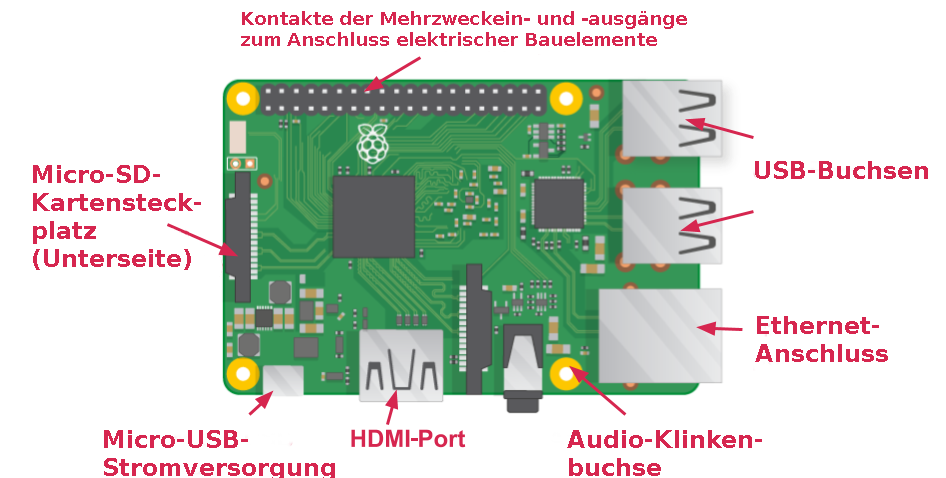

## Darf ich vorstellen, der Raspberry Pi

Werfen wir einen Blick auf den Raspberry Pi. Du solltest dafür einen Raspberry Pi Computer vor dir haben. Es sollte noch mit nichts verbunden sein.

+ Schau dir deinen Raspberry Pi an. Kannst du alle Dinge finden, die in der Grafik bezeichnet sind?

+ **USB-Anschlüsse** - dienen zum Anschluss von Maus und Tastatur. Hier können auch andere Komponenten angeschlossen werden, z. B. ein USB-Stick.

+ **SD-Kartensteckplatz** - Hier kannst Du die SD-Karte einstecken. Auf ihr werden die Betriebssystemsoftware und Deine Dateien gespeichert.

+ **Ethernet-Port** - Hiermit wird der Raspberry Pi über ein Kabel mit einem Netzwerk verbunden. Der Raspberry Pi kann auch über WLAN mit einem Netzwerk verbunden werden.

+ **Audiobuchse** - Hier kannst Du Kopfhörer oder Lautsprecher anschließen.

+ **HDMI-Anschluss** - Hier schließt Du den Monitor (oder Projektor) an, mit dem Du die Ausgabe des Raspberry Pi anzeigst. Wenn Dein Monitor über Lautsprecher verfügt, kann hierüber auch Ton ausgegeben werden.

+ **Micro-USB-Stromanschluss** - hier schließt Du ein Netzteil an. Dies solltest Du immer zuletzt tun, nachdem Du alle anderen Komponenten angeschlossen hast.

+ **GPIO-Ports** - mit denen Du elektrische Bauteile wie LEDs und Taster an den Raspberry Pi anschließen kannst.