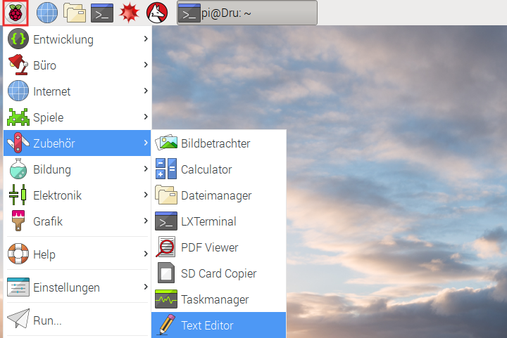
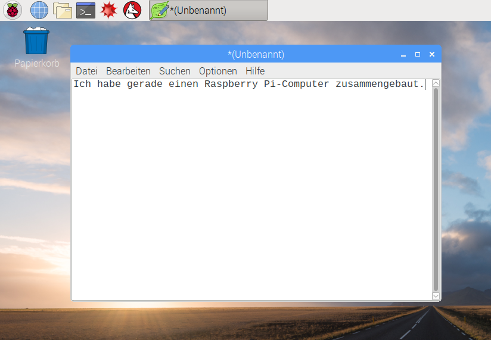
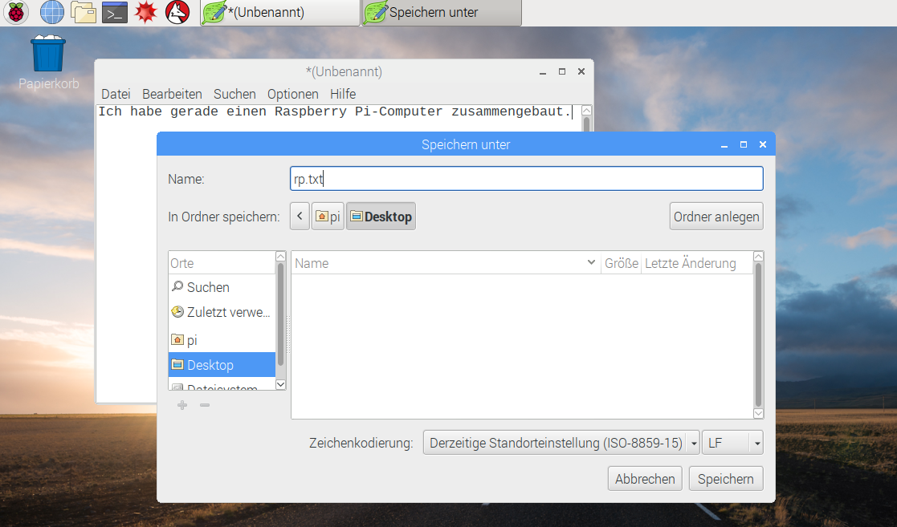
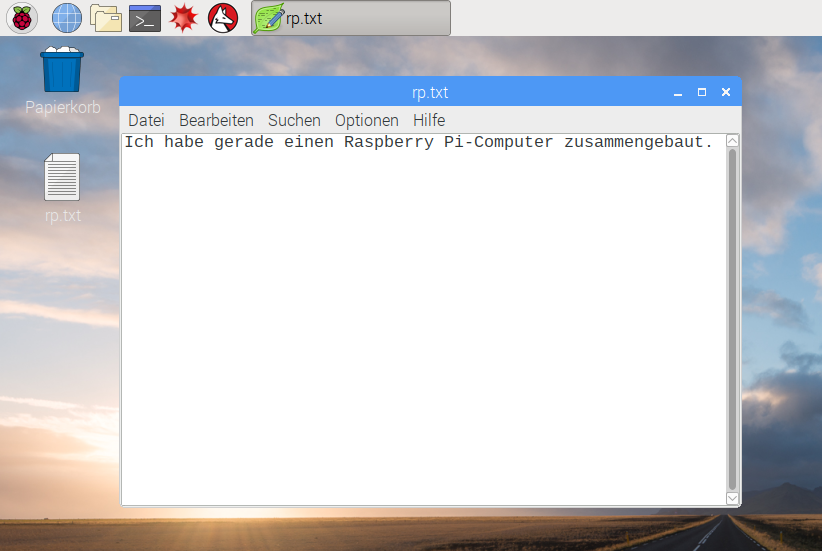
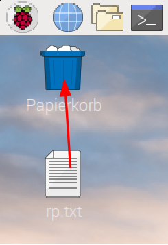

## Rund um den Raspberry Pi

Jetzt ist es Zeit für eine Tour durch die Funktionen des Raspberry Pi.

+ Siehst Du die Himbeere in der oberen linken Ecke? Dort greifst Du auf das Menü zu: Klicke darauf und Du findest viele Anwendungen.

+ Klicke auf **Zubehör** und wähle **Texteditor**.

+ In das Fenster, das sich nun öffnet, tippe `Ich habe gerade einen Raspberry Pi zusammengebaut.`

+ Klicke auf **Datei**, wähle dann **Speichern**, klicke auf **Desktop** und speichere die Datei als `rp.txt`.

+ Auf dem Desktop sollte ein Symbol mit dem Namen `rp.txt` angezeigt werden.

Deine Datei wurde auf der SD-Karte des Raspberry Pi gespeichert.

+ Schließe den Texteditor, indem Du auf **X** in der oberen rechten Ecke des Fensters klickst.

+ Öffne erneut das "Himbeermenü", klicke auf " **Shutdown**" und dann " **Reboot**".

+ Wenn der Pi neu gestartet wurde, sollte Deine Datei immer noch da sein.

+ Der Raspberry Pi läuft mit einer Version eines Betriebssystems namens Linux (Windows und Mac OS sind andere Betriebssysteme). It allows you to make things happen by typing commands instead of clicking on menu options. Klicke auf das **Terminal** oben auf dem Bildschirm:

+ Gib in dem sich öffnenden Fenster ein:

    ls
    

und drücke dann <kbd>Enter</kbd> auf der Tastatur.

Dadurch werden die Dateien in deinem `home`-Verzeichnis aufgelistet.

+ Gib jetzt diesen Befehl ein und wechsele in das Verzeichnis (engl: **c**hange **d**irectory) Desktop:

    cd Desktop
    

Du musst nach jedem Befehl die <kbd>Enter</kbd>-Taste drücken.

Tippe:

    ls
    

Kannst Du die Datei sehen, die Du vorhin gespeichert hast?

+ Schließe das Terminalfenster, indem Du auf **X** klickst.

+ Ziehe nun `rp.txt` in den Papierkorb auf dem Desktop, damit der Pi für die nächste Person bereit ist.
    
    