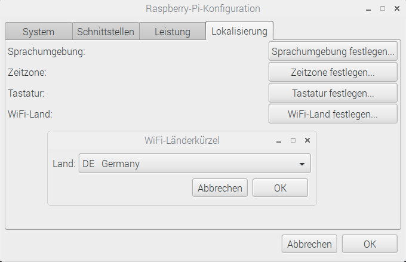
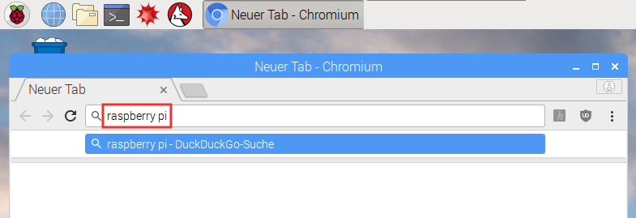

## Im Internet surfen

Vielleicht möchten Sie Ihren Raspberry Pi mit dem Internet verbinden. Wenn Sie kein Ethernet-Kabel angeschlossen haben, müssen Sie eine Verbindung zu einem drahtlosen Netzwerk herstellen.

Um Wi-Fi auf Ihrem Raspberry Pi zu aktivieren, müssen Sie ein WLAN-Land einrichten.

+ Wählen Sie **Einstellungen**, **Raspberry Pi Konfiguration** aus dem Menü.

+ Klicken Sie auf die Registerkarte **Lokalisierung**.

+ Klicken Sie auf **Schaltfläche "WLAN-Land** festlegen".

+ Wählen Sie Ihr Land aus der Liste und klicken Sie auf **OK**.

Sobald das Wi-Fi-Land eingestellt ist, können Sie eine Verbindung zu einem drahtlosen Netzwerk herstellen.

+ Klicken Sie auf das Symbol mit roten Kreuzen in der oberen rechten Ecke des Bildschirms und wählen Sie Ihr Netzwerk aus dem Dropdown-Menü. Möglicherweise müssen Sie einen Erwachsenen fragen, welches Netzwerk Sie wählen sollten.

+ Geben Sie das Kennwort für Ihr drahtloses Netzwerk ein, oder bitten Sie einen Erwachsenen, es für Sie einzugeben, und klicken Sie dann auf **OK**.

+ Wenn Ihr Pi mit dem Internet verbunden ist, sehen Sie anstelle der roten Kreuze ein WLAN-Symbol.

+ Klicken Sie auf das Webbrowser-Symbol und suchen Sie nach `raspberry pi`.

