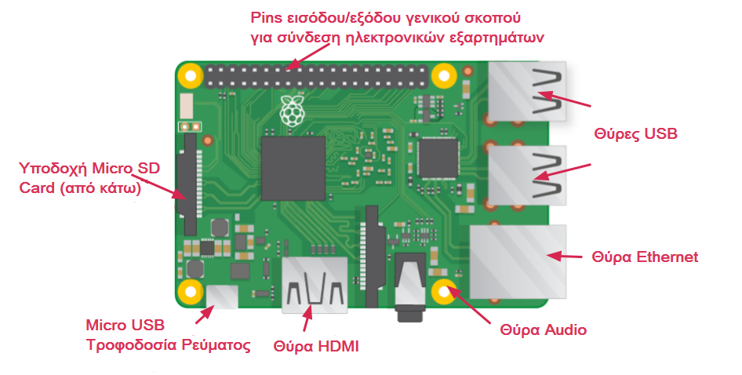

## Γνώρισε το Raspberry Pi

Ας ρίξουμε μια ματιά στο Raspberry Pi. Θα χρειαστεί να έχεις έναν υπολογιστή Raspberry Pi μπροστά σου. Δεν πρέπει να είναι συνδεδεμένο με τίποτα προς το παρόν.

+ Κοίταξε το Raspberry Pi σου. Μπορείς να βρεις όλα τα στοιχεία που επισημαίνονται στο διάγραμμα;

+ **Θύρες USB** - αυτές χρησιμοποιούνται για τη σύνδεση ενός ποντικιού και ενός πληκτρολογίου. Μπορείτε επίσης να συνδέσετε άλλα στοιχεία, όπως μια μονάδα USB.

+ **Υποδοχή κάρτας SD** - μπορείτε να τοποθετήσετε την κάρτα SD εδώ. Εδώ αποθηκεύεται το λογισμικό του λειτουργικού συστήματος και τα αρχεία σας.

+ **Θύρα Ethernet** - χρησιμοποιείται για τη σύνδεση του Raspberry Pi σε δίκτυο με καλώδιο. Το Raspberry Pi μπορεί επίσης να συνδεθεί σε ένα δίκτυο μέσω ασύρματου LAN.

+ **Υποδοχή ήχου** - μπορείτε να συνδέσετε εδώ ακουστικά ή ηχεία.

+ **Θύρα HDMI** - εδώ συνδέετε την οθόνη (ή τον προβολέα) που χρησιμοποιείτε για να εμφανίσετε την έξοδο από το Raspberry Pi. Εάν η οθόνη σας διαθέτει ηχεία, μπορείτε επίσης να τα χρησιμοποιήσετε για να ακούσετε ήχο.

+ **Υποδοχή τροφοδοσίας μικροφώνου USB** - εδώ συνδέετε μια τροφοδοσία ρεύματος. Θα πρέπει πάντα να το κάνετε αυτό το τελευταίο, αφού έχετε συνδέσει όλα τα άλλα στοιχεία.

+ **Θύρες GPIO** - αυτές σας επιτρέπουν να συνδέσετε ηλεκτρονικά εξαρτήματα όπως LED και κουμπιά στο Raspberry Pi.