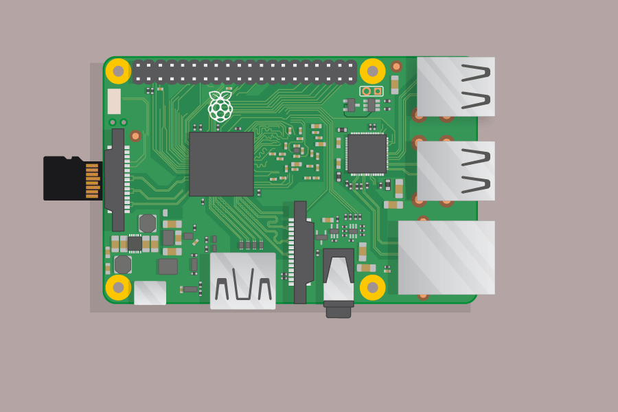

## Συνδέστε το Raspberry Pi

Ας συνδέσουμε το Raspberry Pi σας και να το τρέξουμε.

+ Ελέγξτε αν το Raspberry Pi έχει ήδη μια κάρτα SD στην υποδοχή στην κάτω πλευρά και εάν όχι, τοποθετήστε μια κάρτα SD με εγκατεστημένο το Raspbian (μέσω NOOBS). Πολλές κάρτες SD θα έρθουν μέσα σε ένα μεγαλύτερο προσαρμογέα και μπορείτε να μετακινήσετε την κάρτα έξω από αυτό χρησιμοποιώντας το χείλος στο κάτω μέρος.
    
    

[[[noobs-install]]]

+ Βρείτε τη θύρα USB για το ποντίκι σας και συνδέστε το ποντίκι σε μια από τις θύρες USB του Raspberry Pi (δεν έχει σημασία ποια).
    
    

+ Συνδέστε το πληκτρολόγιο με τον ίδιο τρόπο.
    
    

+ Κοιτάξτε τη θύρα HDMI στο Raspberry Pi - παρατηρήστε ότι έχει μια μεγάλη επίπεδη πλευρά στην κορυφή.
    
    

Βεβαιωθείτε ότι η οθόνη σας είναι συνδεδεμένη σε πρίζα και είναι ενεργοποιημένη.

+ Συνδέστε το καλώδιο οθόνης στη θύρα HDMI του Pi - χρησιμοποιήστε έναν προσαρμογέα, εάν είναι απαραίτητο.

Τίποτα δεν θα εμφανιστεί ακόμα.

+ Συνδέστε τα ακουστικά ή τα ηχεία με την υποδοχή ήχου, εάν έχετε κάποια.

+ Εάν έχετε ένα, χρησιμοποιήστε ένα καλώδιο ethernet για να συνδέσετε τη θύρα Ethernet στο Raspberry Pi σε μια πρίζα Ethernet στον τοίχο ή στον δρομολογητή. (Δεν χρειάζεται να το κάνετε αυτό εάν χρησιμοποιείτε ασύρματο LAN ή εάν δεν θέλετε να συνδεθείτε στο Internet.)

+ Παρατηρήστε ότι η θύρα τροφοδοσίας μικροϋπολογιστή USB έχει μεγαλύτερη επίπεδη πλευρά στην κορυφή.

Συνδέστε την παροχή ρεύματος σε μια πρίζα και συνδέστε την στη θύρα τροφοδοσίας micro USB.

Θα πρέπει να δείτε ένα κόκκινο φως στο Raspberry Pi και σμέουρα στην οθόνη.

Το Pi θα εκκινήσει σε γραφική επιφάνεια εργασίας.

