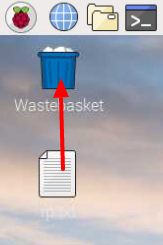

## Μία περιήγηση στο Raspberry Pi

Τώρα ήρθε η ώρα να κάνεις μία περιήγηση στο Raspberry Pi.

+ Βλέπεις το Raspberry στην επάνω αριστερή γωνία; Από εκεί θα έχεις πρόσβαση στο μενού: κάνε κλικ και θα βρεις πολλές εφαρμογές.

+ Κάνε κλικ στο **Accessories** και επέλέξε **Text Editor**.

+ Πληκτρολόγησε `Μόλις δημιούργησα ένα Raspberry Pi` στο παράθυρο που εμφανίζεται.

+ Κάνε κλικ στο **File**, επέλεξε **Save** και στη συνέχεια, κάνε κλικ στο **Desktop** και αποθήκευσε το αρχείο ως `rp.txt`.

+ Θα εμφανιστεί ένα εικονίδιο με το όνομα `rp.txt` στην επιφάνεια εργασίας.

Το αρχείο σου έχει αποθηκευτεί στην κάρτα SD του Raspberry Pi.

+ Κλείσε τον επεξεργαστή κειμένου κάνοντας κλικ στο **X** στην επάνω δεξιά γωνία του παραθύρου.

+ Επέστρεψε στο μενού Raspberry, επέλεξε **Shutdown**και στη συνέχεια **Reboot**.

+ Όταν το Pi έχει επανεκκινήσει, το αρχείο σου θα πρέπει να είναι ακόμα εκεί.

+ Το Raspberry Pi εκτελεί μία έκδοση ενός λειτουργικού συστήματος που ονομάζεται Linux (τα Windows και τα macOS είναι άλλα λειτουργικά συστήματα). It allows you to make things happen by typing commands instead of clicking on menu options. Κάνε κλικ στο **Terminal** στο επάνω μέρος της οθόνης:

+ Στο παράθυρο που εμφανίζεται, πληκτρολόγησε:

    ls
    

και στη συνέχεια πάτησε <kbd>Enter</kbd> στο πληκτρολόγιο.

Έτσι θα εμφανιστούν τα αρχεία στον προσωπικό σου φάκελο `home`.

+ Τώρα πληκτρολόγησε αυτήν την εντολή για να αλλάξεις φάκελο στην επιφάνεια εργασίας:

    cd Desktop
    

Πρέπει να πατάς το πλήκτρο <kbd>Enter</kbd> μετά από κάθε εντολή.

Τύπος:

    ls
    

Μπορείς να δεις το αρχείο που δημιούργησες;

+ Κλείσε το παράθυρο του τερματικού κάνοντας κλικ στο **X**.

+ Τώρα σύρε το `rp.txt` στο Wastebasket στην επιφάνεια εργασίας, ώστε το Pi να είναι έτοιμο για το επόμενο άτομο.
    
    