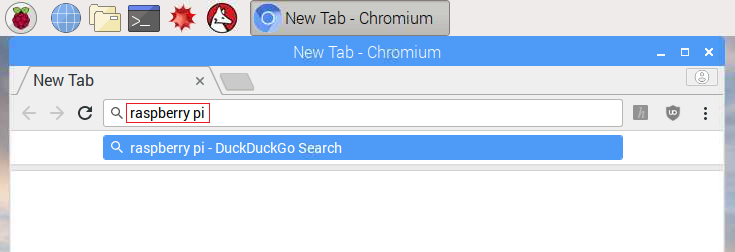

## Browsing the Web (Optional)

+ If you're not using an ethernet cable then you'll need to connect to a wireless network.

+ Click the Wifi icon on the top-right of the screen and ask your Club Leader for Wifi access details.

	

+ Click the Web Browser icon and search for `raspberry pi`.

	

