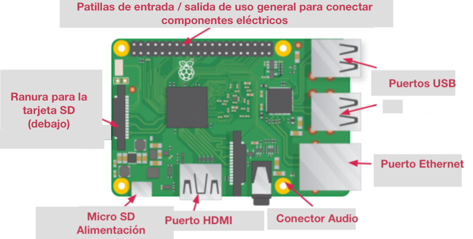

## Conoce a la Raspberry Pi

Echemos un vistazo a la Raspberry Pi. Deberías tener una Raspberry Pi frente a ti para esto. No debería estar conectada a nada todavía.

+ Mira tu Raspberry Pi. ¿Puedes encontrar todas las cosas etiquetadas en el diagrama?

+ **Puertos USB**: se usan para conectar un ratón y un teclado. También puede conectar otros componentes, como una pincho USB.

+ **Ranura para tarjeta SD** - aquí puedes colocar la tarjeta SD. Aquí es donde se almacenan el software del sistema operativo y tus archivos.

+ **Puerto Ethernet** - esto se usa para conectar la Raspberry Pi a una red con un cable. La Raspberry Pi también se puede conectar a una red a través de una LAN inalámbrica.

+ **Conector de audio** - aquí puedes conectar auriculares o altavoces.

+ **Puerto HDMI**: aquí se conecta el monitor (o proyector) que estás utilizando para mostrar la salida de la Raspberry Pi. Si tu monitor tiene altavoces, también puedes usarlos para escuchar el sonido.

+ **Conector de alimentación micro USB**: aquí se conecta una fuente de alimentación. Siempre debe hacer esto lo último, después de haber conectado todos tus otros componentes.

+ **Puertos GPIO**: con ellos puedes conectar componentes electrónicos como LEDs y botones a la Raspberry Pi.