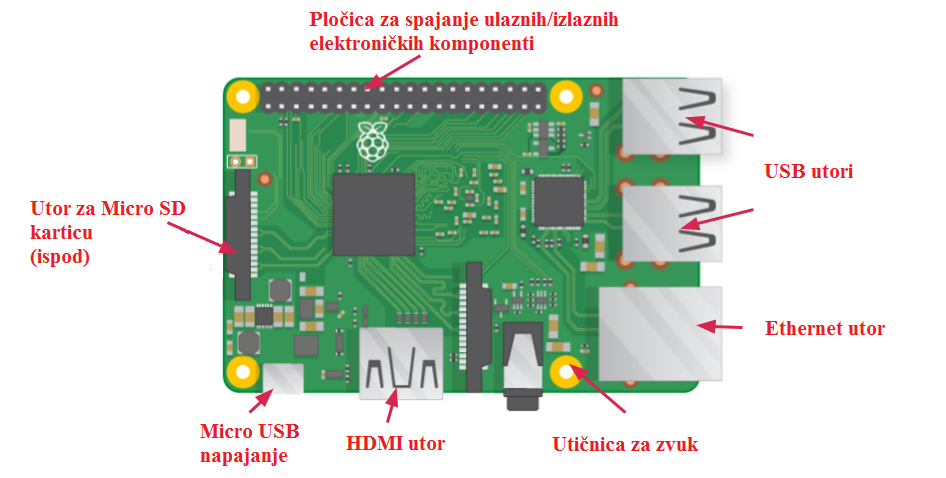

## Upoznaj Raspberry Pi

Bacimo oko na Raspberry Pi. Za to bi trebao imati Raspberry Pi računalo pred sobom. Ne smije još biti povezano s ničim.

+ Pogledaj svoj Raspberry Pi. Možeš li pronaći sve stvari označene na dijagramu?

+ **USB portovi** - oni se koriste za spajanje miša i tipkovnice. Također možete spojiti i druge komponente, poput USB pogona.

+ **utor za SD karticu** - ovdje možete umetnuti SD karticu. Tu se pohranjuju softver operativnog sustava i datoteke.

+ **Ethernet port** - ovo se koristi za povezivanje maline Pi s mrežom pomoću kabela. Raspberry Pi također se može povezati s mrežom putem bežičnog LAN-a.

+ **Audio jack** - Ovdje možete spojiti slušalice ili zvučnike.

+ **HDMI priključak** - ovdje povezujete monitor (ili projektor) koji koristite za prikaz izlaza iz Raspberry Pi. Ako vaš monitor ima zvučnike, možete ih koristiti i za čuti zvuk.

+ **Mikro USB konektor za napajanje** - ovdje možete spojiti napajanje. Uvijek biste trebali to učiniti posljednje, nakon što spojite sve svoje druge komponente.

+ **GPIO priključci** - ti omogućuju povezivanje elektroničkih komponenti poput LED-a i gumba na Raspberry Pi.