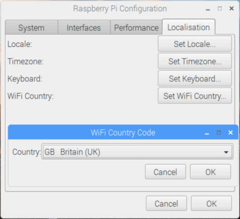
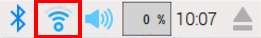

## Pregledavanje Interneta

Možda želiš povezati svoj Raspberry Pi s internetom. Ako nisi priključio ethernet kabel ili se spojio na WiFi mrežu tijekom postavljanja, sada se možeš povezati.

+ Klikni na ikonu s crvenim križićima u gornjem desnom kutu zaslona i odaberi svoju mrežu u padajućem izborniku. Možda ćeš morati pitati odraslu osobu koju mrežu trebaš odabrati.

\--- collapse \---

* * *

## title: Postavi zemlju za Wi-Fi

Ako vidiš poruku "Postavite zemlju za Wi-Fi na kartici Lokalizacija" kada se pokušaš povezati s Wi-Fi mrežom:

+ Select **Preferences** and then **Raspberry Pi Configuration** from the menu.

+ Go to the **Localisation** tab.

+ Click the **Set WiFi Country** button.

+ Select your country from the list and click **OK**.

Once you Wi-Fi country is set, you can connect to a wireless network.

\--- /collapse \---

+ Upišite lozinku za bežičnu mrežu ili zamolite odraslu osobu da ga upiše za vas, a zatim kliknite **OK**.

+ Kad je vaš Pi povezan s internetom, umjesto crvenih križa vidjet ćete simbol bežičnog LAN-a.

+ Kliknite ikonu web preglednika i potražite `malina pi`.

