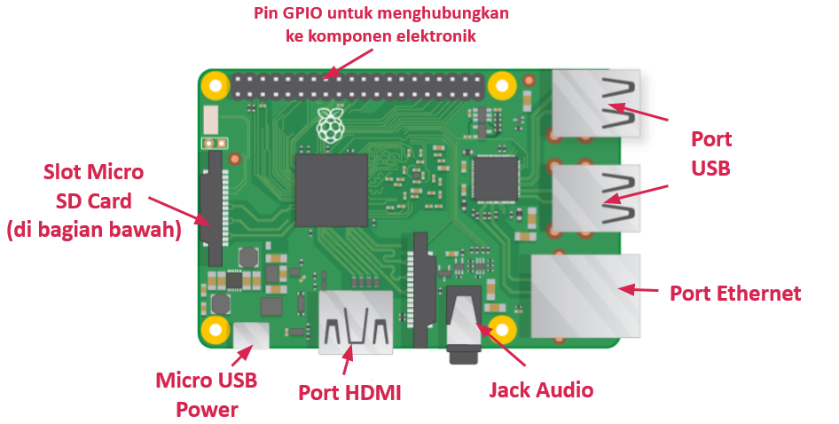

## Temui Raspberry Pi

Mari kita lihat Raspberry Pi. Anda harus memiliki komputer Raspberry Pi di depan Anda untuk ini. Seharusnya tidak terhubung dengan apa pun.

+ Lihatlah Raspberry Pi Anda. Dapatkah Anda menemukan semua hal yang berlabel pada diagram?

+ **Port USB** - ini digunakan untuk menghubungkan mouse dan keyboard. Anda juga dapat menghubungkan komponen lain, seperti drive USB.

+ **Slot kartu SD** - Anda dapat memasang kartu SD di sini. Di sinilah perangkat lunak sistem operasi dan file Anda disimpan.

+ **Port Ethernet** - ini digunakan untuk menghubungkan Raspberry Pi ke jaringan dengan kabel. Raspberry Pi juga dapat terhubung ke jaringan melalui LAN nirkabel.

+ **Soket audio** - Anda dapat menyambungkan headphone atau speaker di sini.

+ **Port HDMI** - ini adalah tempat Anda menyambungkan monitor (atau proyektor) yang Anda gunakan untuk menampilkan output dari Raspberry Pi. Jika monitor Anda memiliki speaker, Anda juga dapat menggunakannya untuk mendengar suara.

+ **Konektor daya USB mikro** - ini adalah tempat Anda menghubungkan catu daya. Anda harus selalu melakukan ini terakhir, setelah Anda menghubungkan semua komponen Anda yang lain.

+ **port GPIO** - ini memungkinkan Anda untuk menghubungkan komponen elektronik seperti LED dan tombol ke Raspberry Pi.