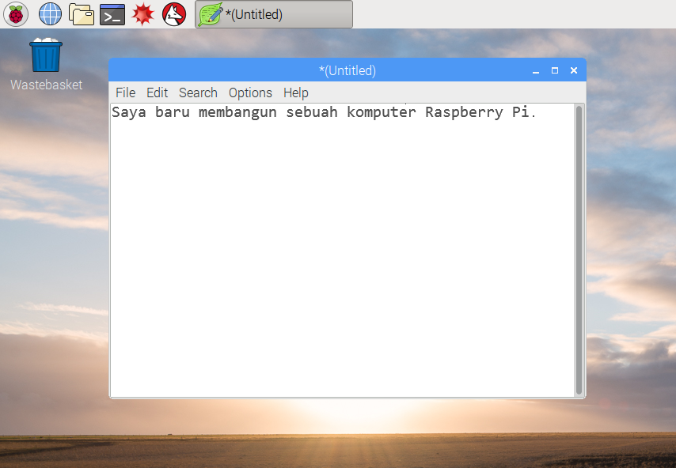
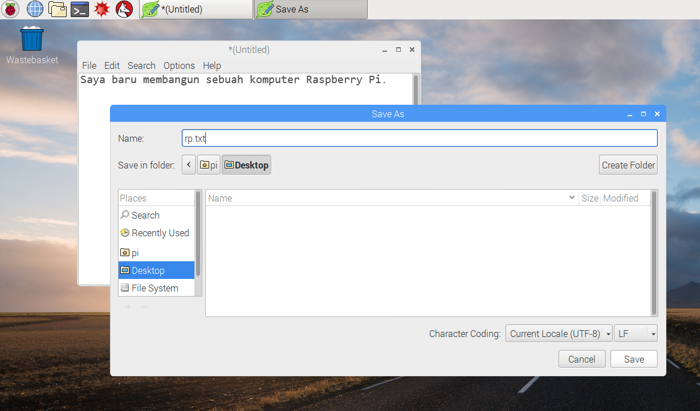
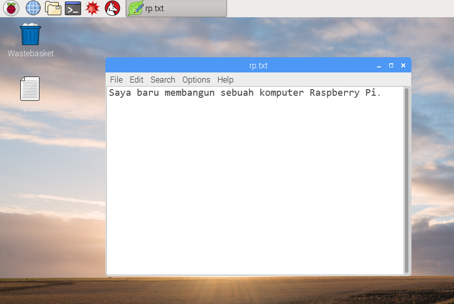

## Tur Raspberry Pi

Sekarang saatnya untuk mengikuti tur Raspberry Pi.

+ Lihat Raspberry di sudut kiri atas? Di situlah Kamu dapat mengakses menu: klik di situ, dan Kamu akan menemukan banyak aplikasi.

+ Klik **Aksesoris** dan pilih **Editor Teks**.

+ Ketik `Saya baru saja membangun Raspberry Pi` di jendela yang muncul.

+ Klik **File**, lalu pilih **Simpan**, lalu klik **Desktop** dan simpan file sebagai `rp.txt`.

+ Anda akan melihat ikon bernama `rp.txt` muncul di desktop.

File Anda telah disimpan ke kartu SD Raspberry Pi.

+ Tutup editor teks dengan mengklik **X** di pojok kanan atas jendela.

+ Kembali ke menu Raspberry, pilih **Shutdown**, lalu pilih **Reboot**.

+ Ketika Pi telah reboot, file Anda harus tetap ada.

+ Raspberry Pi menjalankan versi sistem operasi yang disebut Linux (Windows dan macOS adalah sistem operasi lain). It allows you to make things happen by typing commands instead of clicking on menu options. Klik pada **Terminal** di bagian atas layar:

+ Di jendela yang muncul, ketik:

    ls
    

lalu tekan <kbd>Masukkan</kbd> pada keyboard.

Ini akan mencantumkan file di `direktori rumah` Anda.

+ Sekarang ketik perintah ini ke **c**hange **d**irectory ke Desktop:

    cd Desktop
    

Anda harus menekan <kbd>Masukkan</kbd> kunci setelah setiap perintah.

Mengetik:

    ls
    

Bisakah Anda melihat file yang Anda buat?

+ Tutup jendela terminal dengan mengklik **X**.

+ Sekarang drag `rp.txt` ke keranjang sampah di desktop sehingga Pi akan siap untuk orang berikutnya.
    
    