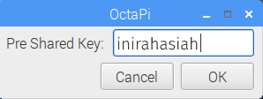

## Menjelajahi web

Anda mungkin ingin menghubungkan Raspberry Pi Anda ke internet. Jika Anda tidak mencolokkan kabel ethernet, maka Anda harus terhubung ke jaringan nirkabel.

Untuk mengaktifkan Wi-Fi di Raspberry Pi Anda, Anda harus menetapkan negara Wi-Fi.

+ Pilih **Preferensi**, **Raspberry Pi Configuration** dari menu.

+ Klik **pelokalan** tab.

+ Klik **Setel tombol WiFi Country**.

+ Pilih negara Anda dari daftar dan klik **OK**.

Setelah Anda menetapkan negara Wi-Fi Anda dapat terhubung ke jaringan nirkabel.

+ Klik ikon dengan tanda silang merah di sudut kanan atas layar, dan pilih jaringan Anda dari menu drop-down. Anda mungkin perlu meminta jaringan orang dewasa yang harus Anda pilih.

+ Ketik kata sandi untuk jaringan nirkabel Anda, atau minta orang dewasa untuk mengetikkannya untuk Anda, lalu klik **OK**.

+ Ketika Pi Anda terhubung ke internet, Anda akan melihat simbol LAN nirkabel bukan salib merah.

+ Klik ikon browser web dan cari `raspberry pi`.

