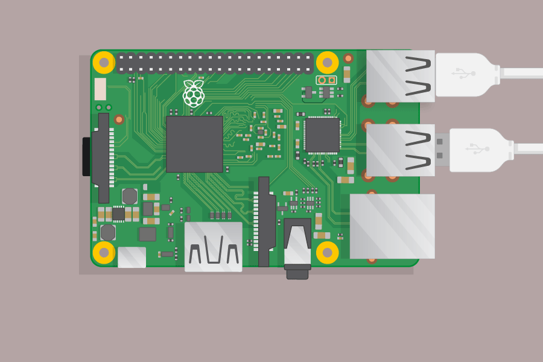
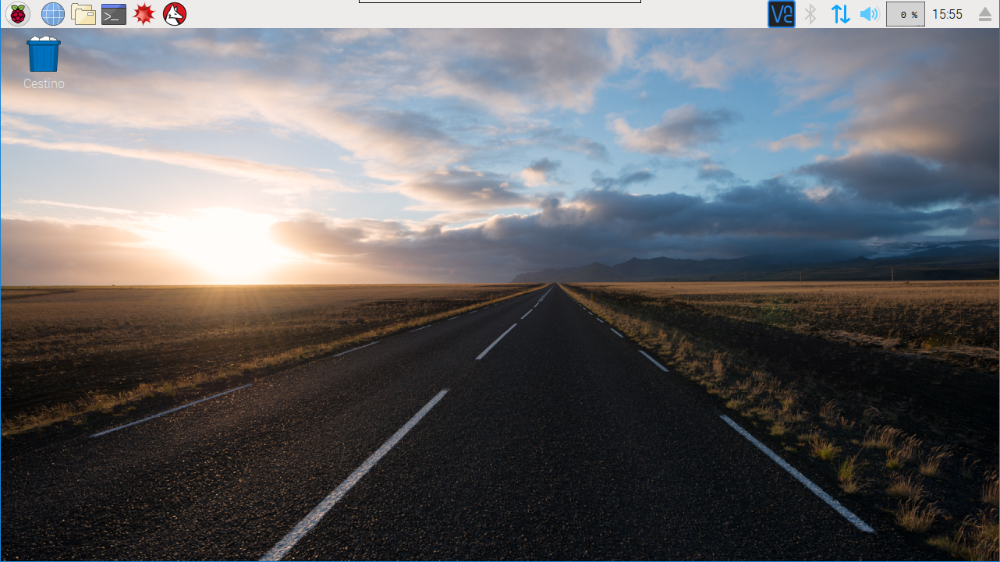

## Collega il tuo Raspberry Pi

Colleghiamo il tuo Raspberry Pi e fallo funzionare.

+ Controlla se il tuo Raspberry Pi ha già una scheda SD nello slot nella parte inferiore e, in caso contrario, inserisci una scheda SD con Raspbian installato (tramite NOOBS). Un sacco di schede SD entrano in un adattatore più grande, e si può far scorrere la carta da questo usando il labbro in basso.
    
    

[[[noobs-install]]]

+ Trova il connettore USB per il tuo mouse e collega il mouse a una delle porte USB del Raspberry Pi (non importa quale).
    
    

+ Collega la tastiera allo stesso modo.
    
    

+ Guarda la porta HDMI sul Raspberry Pi - nota che ha un grande lato piatto in cima.
    
    

Assicurati che il monitor sia collegato a una presa a muro e acceso.

+ Collegare il cavo del monitor alla porta HDMI di Pi - utilizzare un adattatore se necessario.

Niente verrà ancora visualizzato.

+ Collega le cuffie o gli altoparlanti al jack audio se ne hai.

+ Se ne possiedi uno, utilizza un cavo Ethernet per collegare la porta Ethernet del Raspberry Pi a una presa ethernet sul muro o sul router. (Non è necessario farlo se si utilizza la LAN wireless o se non si desidera connettersi a Internet.)

+ Si noti che la porta di alimentazione micro USB ha un lato più lungo in alto.

Collegare l'alimentatore a una presa e collegarlo alla porta di alimentazione micro USB.

Dovresti vedere una luce rossa sul Raspberry Pi e lamponi sul monitor.

Il Pi si avvierà in un desktop grafico.

