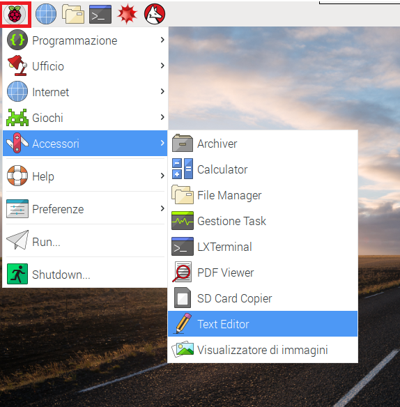
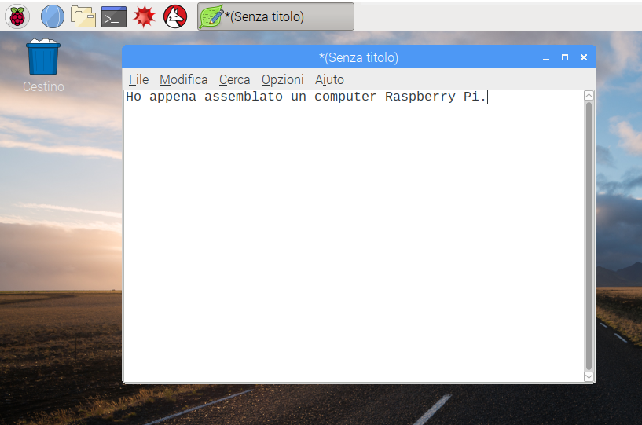
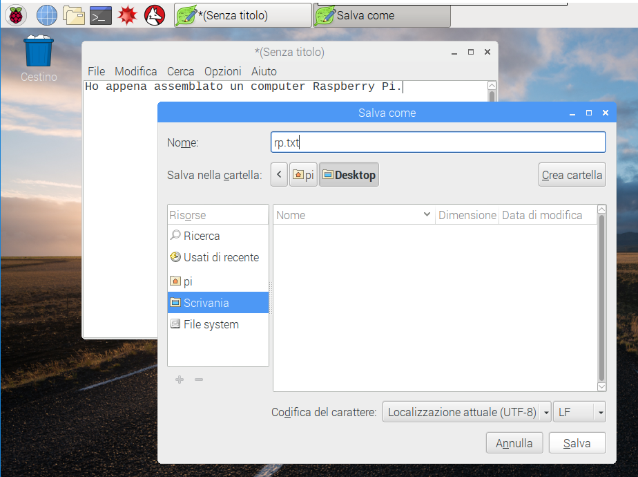
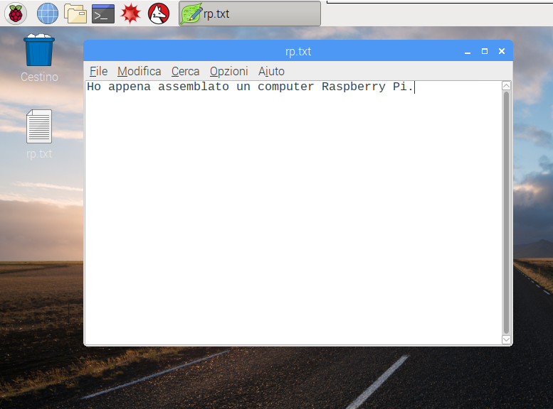
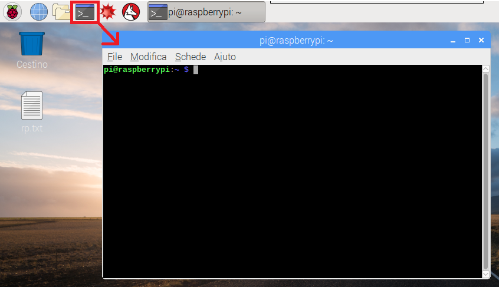
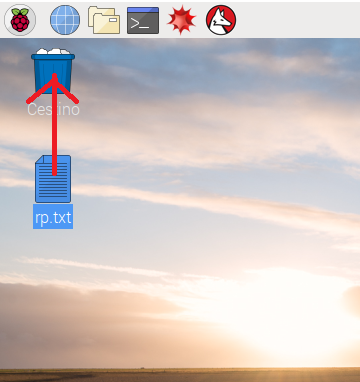

## Dentro il Raspberry Pi

Facciamo un giro all'interno del Raspberry Pi.

+ Vedi l'icona a forma di lampone (in inglese raspberry!) nell'angolo in alto a sinistra dello schermo? È lì che puoi accedere al menu del desktop: fai clic sull'icona per visualizzare le applicazioni.

+ Fai click su **Accessori** e seleziona **Editor di testo**.

+ Digita `Ho appena assemblato un computer Raspberry Pi` nella finestra che appare.

+ Fai click su **File**, seleziona **Salva**, e poi fai click su **Desktop**. Salva il file come `rp.txt`.

+ Una nuova icona chiamata `rp.txt` dovrebbe apparire sul desktop.

Il tuo file è stato salvato nella scheda di memoria SD del Raspberry Pi.

+ Chiudi l'editor di testo facendo clic sulla **x** che si trova nell'angolo in alto a destra della finestra.

+ Ritorna al menu principale, clicca su **Spegni**, e seleziona **Riavvia**.

+ Dopo aver riavviato il computer, il tuo file dovrebbe essere ancora lì.

+ Il Raspberry Pi funziona con una particolare versione di un sistema operativo chiamato Linux (Windows e macOS sono altri sistemi operativi). It allows you to make things happen by typing commands instead of clicking on menu options. Fai clic sul **Terminale** nella parte superiore dello schermo:

+ Nella finestra che appare, digita:

    ls
    

e premi il tasto <kbd>Invio</kbd> sulla tastiera.

Questo comando ti mostrerà l'elenco dei file presenti nella tua `cartella home`.

+ Ora scrivi questo comando per cambiare cartella, ad esempio passando al desktop:

    cd Desktop
    

<kbd>cd</kbd> sta per <0>c</0>hange <0>d</0>irectory, ovvero <0>cambia cartella</0>. Ricorda di premere il tasto <0>Invio</0> dopo ogni comando.

Scrivi:

    ls
    

Riesci a vedere il file che hai creato?

+ Chiudi la finestra del terminale facendo clic sulla **x** in alto a destra.

+ Ora trascina `rp.txt` nel Cestino che si trova sul desktop, per lasciare libero il Raspberry Pi per il prossimo utente.
    
    