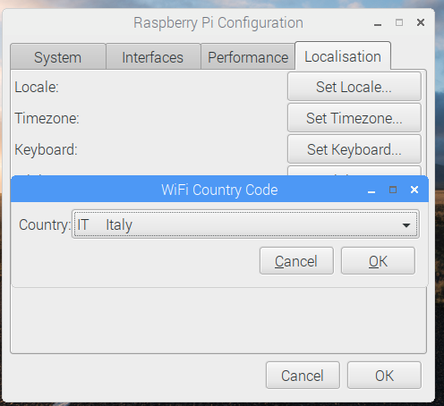
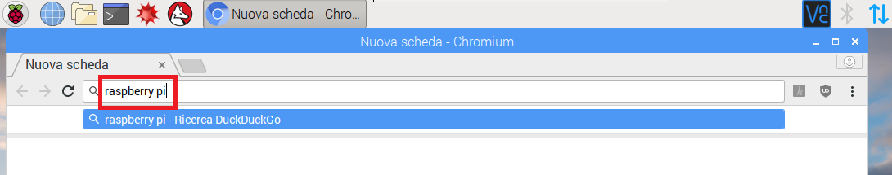

## Navigando nel web

Potresti voler collegare il tuo Raspberry Pi a Internet. Se non si è collegato un cavo Ethernet, sarà necessario connettersi a una rete wireless.

Per abilitare il Wi-Fi sul tuo Raspberry Pi dovrai impostare una nazione Wi-Fi.

+ Seleziona **Preferenze**, **Configurazione Raspberry Pi** dal menu.

+ Fai clic sulla scheda **Localizzazione**.

+ Fai clic su **Imposta il pulsante Paese WiFi**.

+ Seleziona il tuo paese dall'elenco e fai clic su **OK**.

Una volta impostato il Paese Wi-Fi, è possibile connettersi a una rete wireless.

+ Fai clic sull'icona con croci rosse nell'angolo in alto a destra dello schermo e seleziona la tua rete dal menu a discesa. Potrebbe essere necessario chiedere ad un adulto quale rete scegliere.

+ Inserisci la password per la tua rete wireless o chiedi a un adulto di digitarla per te, quindi fai clic su **OK**.

+ Quando il tuo Pi è connesso a Internet, vedrai un simbolo LAN wireless al posto delle croci rosse.

+ Fare clic sull'icona del browser Web e cercare `raspberry pi`.

