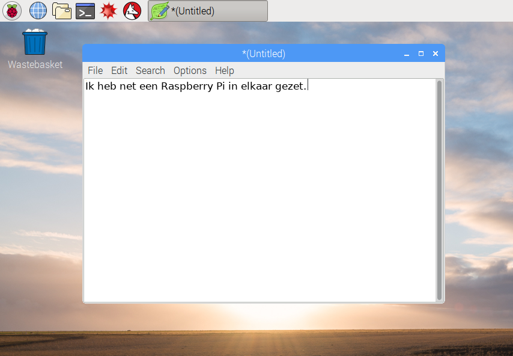
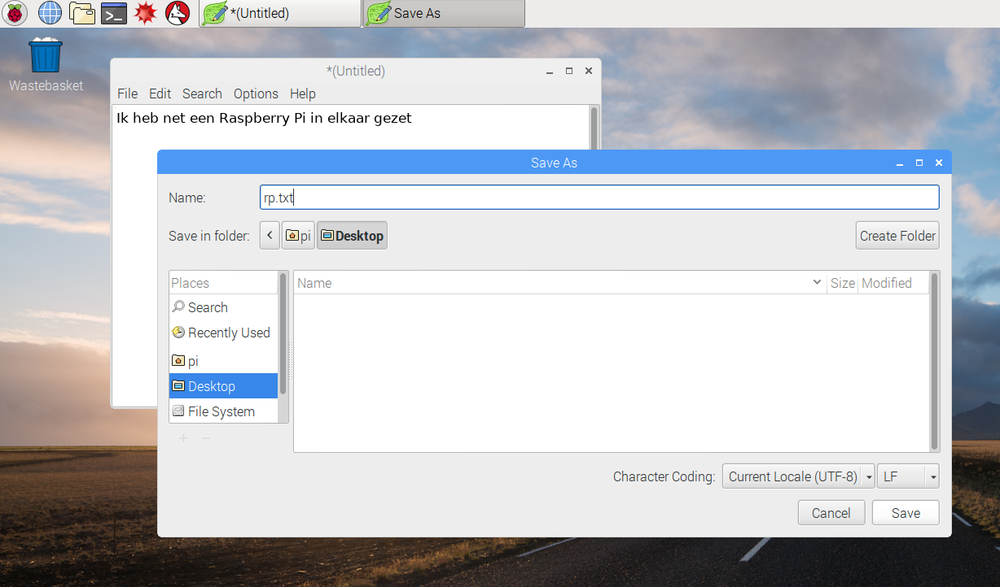
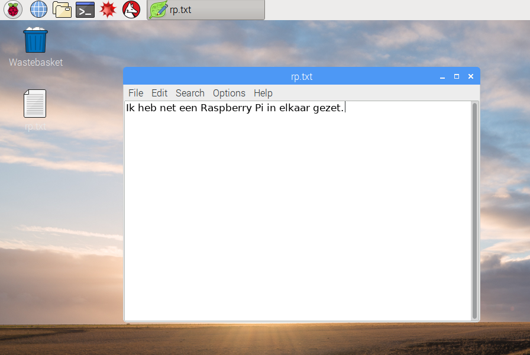

## Een Raspberry Pi rondleiding

Nu is het tijd voor een rondleiding door de Raspberry Pi.

+ Zie je die framboos in de linkerbovenhoek? Dat is waar je het menu opent: klik erop voor de vele toepassingen.

+ Klik op **Accessories** en kies **Text Editor**.

+ Typ `Ik heb net een Raspberry Pi in elkaar gezet` in het venster dat verschijnt.

+ Klik op **File**, kies **Save** en klik dan vervolgens op **Desktop** en sla het bestand op als `rp.txt`.

+ Er zou een pictogram met de naam `rp.txt` op het bureaublad moeten verschijnen.

Het bestand is opgeslagen op de SD-kaart van de Raspberry Pi.

+ Sluit de teksteditor door te klikken op **X** in de rechterbovenhoek van het venster.

+ Keer terug naar het Raspberry-menu, kies **Shutdown** en vervolgens **Reboot**.

+ Wanneer de Pi opnieuw is opgestart, moet het bestand er nog steeds zijn.

+ Op de Raspberry Pi loopt een versie van een besturingssysteem met de naam Linux (Windows en macOS zijn andere besturingssystemen). Je kunt opdrachten typen in plaats van op menu-opties te klikken. Klik op de **Terminal** boven aan het scherm:

+ Typ in het venster dat verschijnt:

    ls
    

en druk dan op <kbd>Enter</kbd> op het toetsenbord.

Hiermee worden de bestanden van de map `home` getoond.

+ Typ nu deze opdracht voor een **c**hange **d**irectory, (Engels voor 'verander van map') om naar het bureaublad te gaan:

    cd Desktop
    

Je moet na elke opdracht op de <kbd>Enter</kbd> -toets drukken.

Typ:

    ls
    

Zie je het bestand dat je hebt gemaakt?

+ Sluit het terminalvenster door op **X** te klikken.

+ Versleep nu `rp.txt` naar de prullebak op het bureaublad zodat de Pi klaar staat voor de volgende gebruiker.
    
    