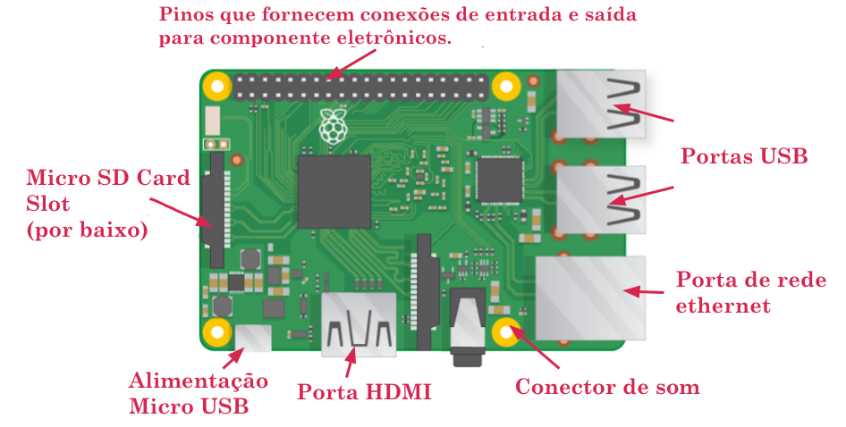

## Conheça o Raspberry Pi

Vamos dar uma olhada no Raspberry Pi. Você deve ter um computador Raspberry Pi na sua frente para isso. Ele não deve ser conectado a nada ainda.

+ Olhe para o seu Raspberry Pi. Você pode encontrar todas as coisas marcadas no diagrama?

+ ** Portas USB ** - usadas ​​para conectar um mouse e teclado. Você também pode conectar outros componentes, como um pendrive.

+ ** Slot para cartão SD ** - você pode inserir o cartão SD aqui. É aqui que o software do sistema operacional e seus arquivos são armazenados.

+ ** Porta Ethernet ** - usada para conectar o Raspberry Pi a uma rede com um cabo. O Raspberry Pi também pode se conectar a uma rede local sem fio.

+ ** Entrada de áudio ** - você pode conectar fones de ouvido ou alto-falantes aqui.

+ ** Porta HDMI ** - é aqui que você conecta o monitor (ou projetor) que você está usando para exibir a saída do Raspberry Pi. Se o seu monitor tiver alto-falantes, você também poderá usá-los para ouvir o som.

+ ** Conector de alimentação Micro USB ** - é aqui que você conecta uma fonte de alimentação. Você deve sempre fazer isso por último, depois de ter conectado todos os seus outros componentes.

+ ** Portas GPIO ** - permitem conectar componentes eletrônicos como LEDs e botões ao Raspberry Pi.