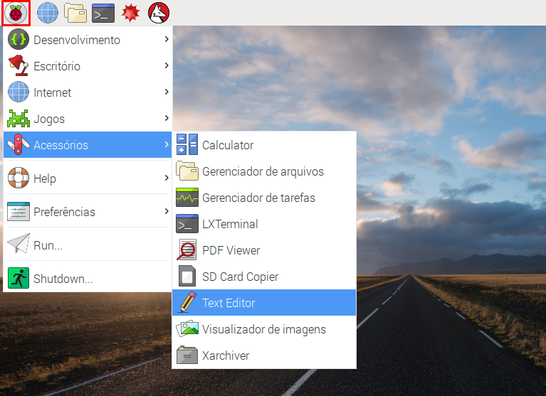
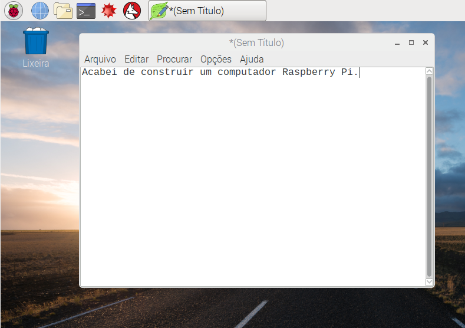
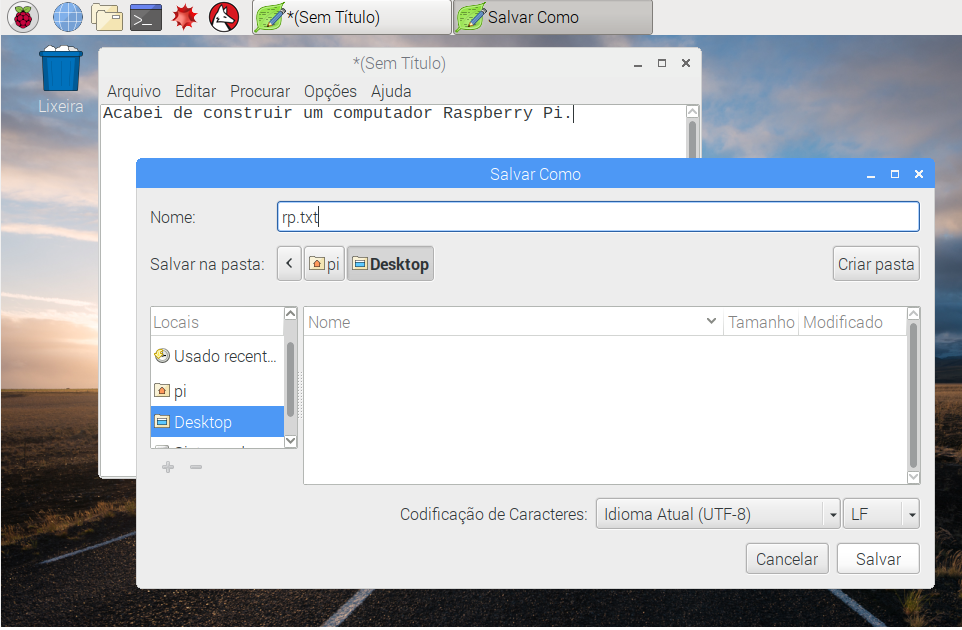
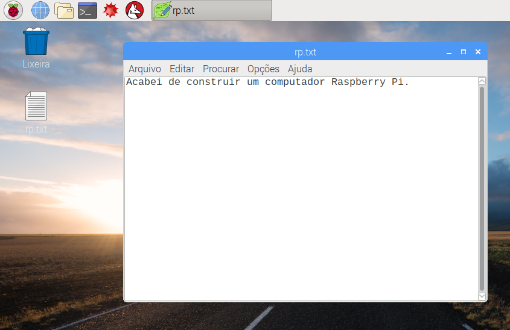
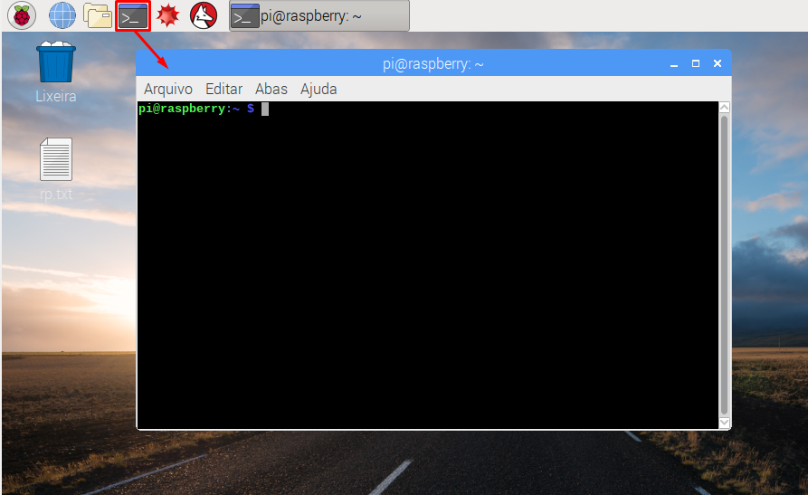
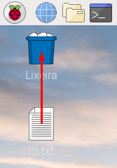

## Um passeio pelo Raspberry Pi

Agora é hora de fazer um tour do Raspberry Pi.

+ Veja aquele Framboesa no canto superior esquerdo? É aí que você acessa o menu: clique nele e você encontrará muitas aplicações.

+ Clique **Acessórios** e escolha **Editor de texto**.

+ Digite `Eu acabei de construir um Raspberry Pi` na janela que aparece.

+ Clique em **Arquivo**, então escolha **Salvar**, e clique em **Área de Trabalho** e salvar o arquivo como `rp.txt`.

+ Você deve ver um ícone chamado `rp.txt ` aparecer na área de trabalho.

Seu arquivo foi salvo no cartão SD do Raspberry Pi.

+ Feche o editor de texto clicando no **X** no canto superior direito da janela.

+ Retornar ao menu Framboesa, escolha **Desligar** e, em seguida, escolha **Reiniciar** .

+ Quando o Pi for reinicializado, seu arquivo ainda estará lá.

+ O Raspberry Pi executa uma versão de um sistema operacional chamado Linux (Windows e MacOS são outros sistemas operacionais). It allows you to make things happen by typing commands instead of clicking on menu options. Clique no **Terminal** no topo da tela:

+ Na janela exibida, digite:

    ls
    

e, em seguida, pressione <kbd>Enter</kbd> no teclado.

Isto irá listar os arquivos em seu diretório `home`.

+ Agora digite este comando **cd** (change directory, utilizado para mudar de diretório no Raspberry Pi) para acessar o diretório "área de trabalho" (Desktop), conforme o exemplo abaixo:

    cd Desktop
    

Você tem que pressionar <kbd>Enter</kbd> após cada comando.

Digite:

    ls
    

Você pode ver o arquivo que você criou?

+ Feche a janela do terminal clicando no **X**.

+ Agora arraste `rp.txt` para a Lixeira na área de trabalho então o Raspberry Pi estará pronto para a próxima pessoa utilizar.
    
    