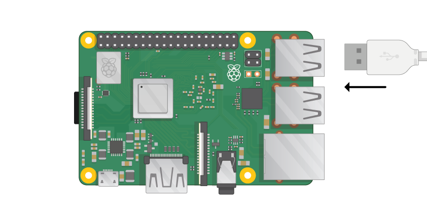

## Conectează-ți Zmeura Pi

Hai să ne conectăm pe Pi Ză și să o facem să fie difuzată.

+ Verificați dacă Raspberry Pi are deja o cartelă SD în slotul din partea inferioară și, dacă nu, introduceți un card SD cu Raspbian instalat (prin intermediul NOOBS). O mulțime de carduri SD vor intra într-un adaptor mai mare și puteți glisa cardul din acesta folosind buza din partea inferioară.
    
    

[[[noobs-install]]]

+ Găsiți conectorul USB al mouse-ului și conectați mouse-ul la unul dintre porturile USB de pe Raspberry Pi (nu contează pe care).
    
    

+ Conectați tastatura în același mod.
    
    

+ Uită-te la portul HDMI de pe Raspberry Pi - observați că are o latură mare plat pe partea de sus.
    
    

Asigurați-vă că monitorul este conectat la o priză de perete și că este pornit.

+ Conectați cablul monitorului la portul HDMI al lui Pi - utilizați un adaptor, dacă este necesar.

Nimic nu se va afișa încă.

+ Conectați căștile sau difuzoarele la mufa audio dacă aveți unele.

+ Dacă aveți unul, utilizați un cablu Ethernet pentru a conecta portul Ethernet de pe Raspberry Pi la o priză Ethernet de pe perete sau de pe router. (Nu trebuie să faceți acest lucru dacă utilizați o rețea LAN fără fir sau dacă nu doriți să vă conectați la internet.)

+ Observați că portul de alimentare micro USB are o latură plană mai lungă deasupra.

Conectați sursa de alimentare la o priză și conectați-o la portul de alimentare micro USB.

Ar trebui să vedeți o lumină roșie pe Zmeura Pi și zmeura pe monitor.

Pi va porni într-un desktop grafic.

