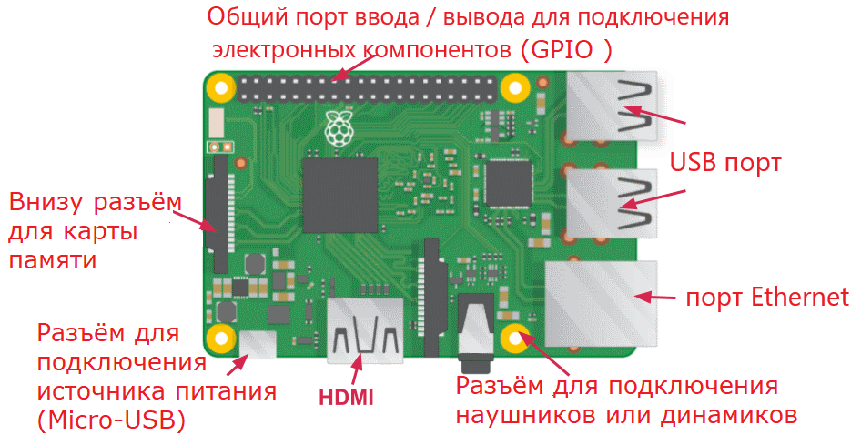

## Познакомьтесь с малиной Pi

Давайте посмотрим на Малину Пи. Для этого у вас должен быть компьютер с малиной Pi. Его еще нельзя подключать.

+ Посмотрите на свою малину Пи. Можете ли вы найти все, что помечено на диаграмме?

+ **USB-порты** - они используются для подключения мыши и клавиатуры. Вы также можете подключать другие компоненты, такие как USB-накопитель.

+ **Слот для SD-карты** - здесь вы можете сложить SD-карту. Здесь хранится программное обеспечение операционной системы и ваши файлы.

+ **Порт Ethernet** - это используется для подключения малины Pi к сети с кабелем. Raspberry Pi также может подключаться к сети через беспроводную локальную сеть.

+ **Разъем аудиосигнала** - здесь вы можете подключить наушники или динамики.

+ **Порт HDMI** - здесь вы подключаете монитор (или проектор), который вы используете для отображения вывода из малины Pi. Если на вашем мониторе есть динамики, вы также можете использовать их для прослушивания звука.

+ **Разъем питания Micro USB** - здесь вы подключаете источник питания. Вы должны всегда делать это последним, после того как вы подключили все остальные компоненты.

+ **GPIO-порты** - это позволяет подключать электронные компоненты, такие как светодиоды и кнопки, к малиновому Pi.