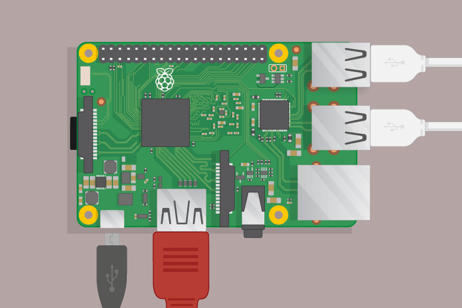

## Подключите малину Pi

Давайте подключим ваш малиновый Pi и убедимся.

+ Убедитесь, что у вашей малины Pi уже есть SD-карта в слоте на нижней стороне, а если нет, вставьте SD-карту с установленной Raspbian (через NOOBS). Множество SD-карт появится внутри большего адаптера, и вы можете вытащить карту из нее, используя губу внизу.
    
    

[[[noobs-install]]]

+ Найдите USB-разъем для мыши и подключите мышь к одному из USB-портов на малиновом Pi (неважно, какой из них).
    
    

+ Подключите клавиатуру таким же образом.
    
    

+ Посмотрите на порт HDMI на малине Pi - обратите внимание, что он имеет большую плоскую сторону сверху.
    
    

Убедитесь, что ваш монитор подключен к розетке и включен.

+ Подключите кабель монитора к порту HDMI Pi - при необходимости используйте адаптер.

Пока ничего пока не видно.

+ Подключите наушники или динамики к аудиоразъему, если у вас есть.

+ Если у вас есть, используйте сетевой кабель, чтобы подключить порт Ethernet к малине Pi к розетке Ethernet на стене или на вашем маршрутизаторе. (Вам не нужно делать это, если вы будете использовать беспроводную локальную сеть или если вы не хотите подключаться к Интернету.)

+ Обратите внимание, что порт питания micro USB имеет более длинную плоскую сторону сверху.

Подключите блок питания к гнезду и подключите его к порту питания micro USB.

Вы должны увидеть красный свет на Малиновой Пи и малину на мониторе.

Pi загрузится в графический рабочий стол.

