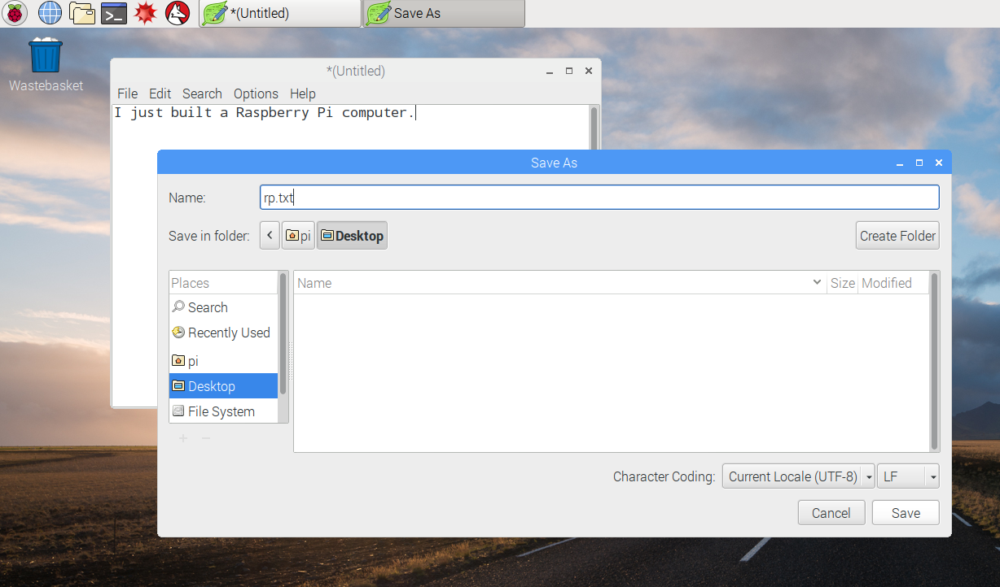

## Экскурсия по Raspberry Pi

Пришло время совершить экскурсию по Raspberry Pi.

+ Посмотри в верхний левый угол экрана монитора. Что ты там видишь? Здесь находится кнопка вызова меню: нажми на неё и ты найдёшь множество приложений.

+ Нажмите **Accessories** и выбери **Text Editor**.

+ В появившемся окне введи `I just built a Raspberry Pi`.

+ Щёлкни на меню **File** (Файл), затем выбери **Save** (Сохранить), а затем щелкни **Desktop** и сохрани файл как `rp.txt`.

+ На рабочем столе появится значок `rp.txt`.

Твой файл был сохранен на SD-карте Raspberry Pi.

+ Закрой текстовый редактор, щелкнув **X** в правом верхнем углу окна.

+ Вернись в меню Raspberry, выбери **Shutdown** (Завершение работы), а затем выбери **Reboot** (Перезагрузка).

+ Когда Pi перезагрузится, твой файл все равно должен быть на том же месте.

+ Raspberry Pi работает под управлением операционной системы, которая называется Linux (Windows и MacOS - это другие операционные системы). It allows you to make things happen by typing commands instead of clicking on menu options. Щёлкни на значке **Terminal** в верхней части экрана:

+ В появившемся окне введи:

    ls
    

а затем нажми <kbd>Enter</kbd> на клавиатуре.

В результате этого ты увидишь список файлов папки `home`.

+ Теперь введи вот эту команду, чтобы перейти к папке Рабочего стола **c**hange **d**irectory:

    cd Desktop
    

После ввода каждой команды нужно нажимать клавишу <kbd>Enter</kbd>.

Введи:

    ls
    

Ты видишь файл, который мы недавно создали?

+ Закрой окно терминала, нажав на **X**.

+ Теперь перетащи `rp.txt` в Wastebasket (Корзину) на Рабочем столе, чтобы Pi была готова для работы со следующим человеком.
    
    