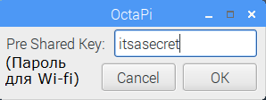

## Просмотр веб-страниц

Возможно, вы захотите подключить свой малиновый Pi к Интернету. Если вы не подключили кабель Ethernet, вам необходимо подключиться к беспроводной сети.

Чтобы включить Wi-Fi на вашем малиновом Pi, вам необходимо установить страну Wi-Fi.

+ В меню выберите **Настройки**, **Конфигурация малины Pi**.

+ Перейдите на вкладку **«Локализация**».

+ Нажмите кнопку **. Установите WiFi Country**.

+ Выберите свою страну из списка и нажмите **OK**.

Как только вы установили Wi-Fi страну, вы можете подключиться к беспроводной сети.

+ Нажмите значок с красными крестиками в правом верхнем углу экрана и выберите свою сеть в раскрывающемся меню. Вам может потребоваться спросить взрослого, какую сеть вы должны выбрать.

+ Введите пароль для своей беспроводной сети или попросите взрослого ввести его для вас, затем нажмите **OK**.

+ Когда ваш Pi подключен к Интернету, вы увидите символ беспроводной локальной сети вместо красных крестов.

+ Щелкните значок веб-браузера и выполните поиск `малины pi`.

