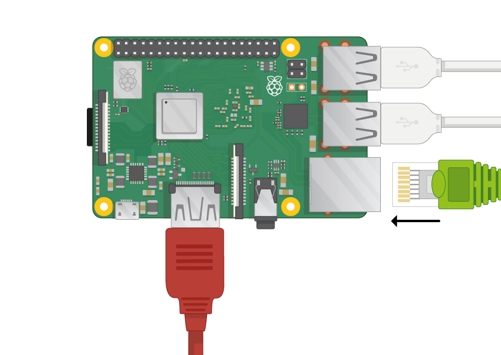
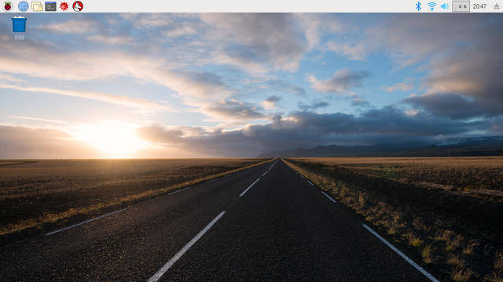

## Zapojte svoje Raspberry Pi

Poďme zapojiť a spustiť vaše Raspberry Pi.

+ Skontrolujte, či vaše Raspberry Pi už má SD kartu v slote na spodnej strane a ak nie, tak do neho zasuňte SD kartu s nainštalovaným systémom Raspbian (cez NOOBS).
    
    

Veľa SD kariet je dodávaných vo vnútri väčšieho adaptéra. SD kartu vtedy musíte vytiahnuť von ťahaním za jej okraj.

[[[noobs-install]]]

+ Vezmite USB konektor vašej myši a pripojte ho k niektorému z USB portov na Raspberry Pi (nezáleží na tom, do ktorého z nich).
    
    

+ Connect the keyboard in the same way.
    
    

+ Pozrite sa na HDMI port na Raspberry Pi - všimnite si, že má širšiu stranu hore.
    
    

Uistite sa, že je váš monitor zapojený do zásuvky, a že je zapnutý.

+ Pripojte kábel monitora do HDMI portu Raspberry Pi - v prípade potreby použite adaptér.

Zatiaľ sa nič nezobrazí.

+ If you want to connect the Pi to the internet via Ethernet, use an Ethernet cable to connect the Ethernet port on the Raspberry Pi to an Ethernet socket on the wall or on your internet router. You don't need to do this if you'll be using WiFi or if you don't want to connect to the internet.

+ Sound will come from your screen if it has speakers or you can connect headphones or speakers to the audio jack if you have them.

+ Všimnite si, že napájací port micro USB má širšiu rovnú stranu hore.

Zapojte napájací zdroj do zásuvky a pripojte ho do napájacieho micro USB portu.

Na Raspberry Pi by ste mali vidieť svietiť červené svetlo a na monitore maliny.

Raspberry Pi sa spustí do grafického používateľského rozhrania.

