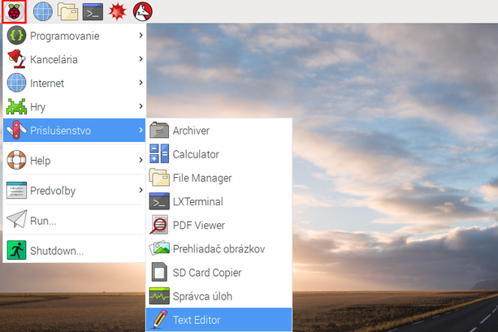
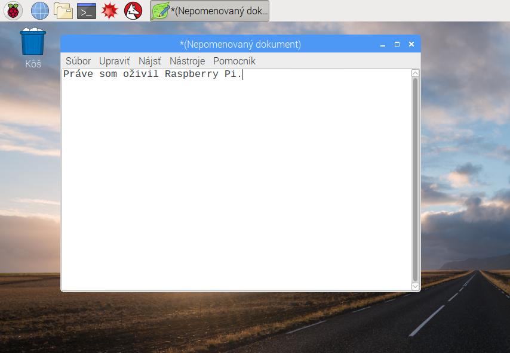
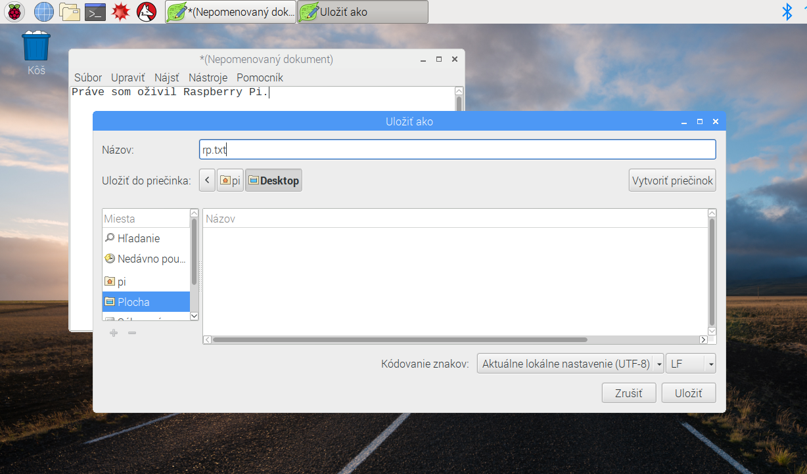
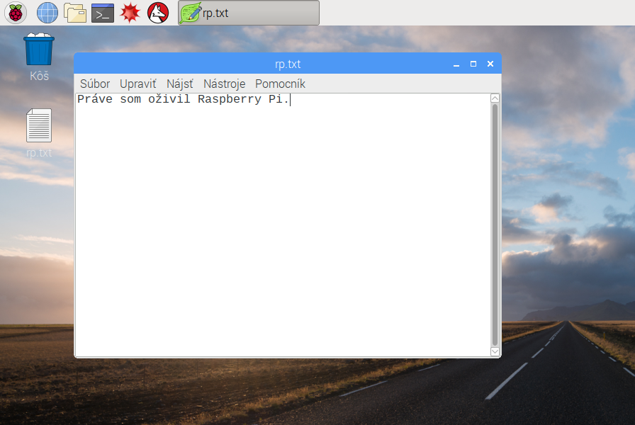
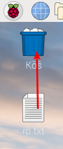

## Prehliadka Raspberry Pi

Teraz je čas vziať si prehliadku Raspberry Pi.

+ Pozrite sa na Raspberry hore v ľavom hornom rohu? To je miesto, kde vstúpite do ponuky: kliknite na ňu a nájdete veľa aplikácií.

+ Kliknite na **Príslušenstvo** a vyberte **Text Editor**.

+ Typ `V okne, ktoré sa zobrazí, som postavil Raspberry Pi`.

+ Kliknite na **Súbor**, potom vyberte **Uložiť**a potom kliknite na **Plochu** a uložte súbor ako `rp.txt`.

+ Na pracovnej ploche by sa mala zobraziť ikona s názvom `rp.txt`.

Váš súbor bol uložený na SD kartu Raspberry Pi.

+ Zatvorte textový editor kliknutím na **X** v pravom hornom rohu okna.

+ Vráťte sa do ponuky Raspberry, zvoľte **Vypnutie**a potom zvoľte **Reboot**.

+ Po reštartovaní súboru Pi by mal byť váš súbor stále tam.

+ Raspberry Pi prevádzkuje verziu operačného systému nazvaného Linux (Windows a MacOS sú iné operačné systémy). Umožňuje to, aby ste sa stali písaním príkazov namiesto kliknutia na možnosti menu. Kliknite na **Terminal** v hornej časti obrazovky:

+ V okne, ktoré sa zobrazí, zadajte:

    ls
    

a potom stlačte <kbd>Zadajte</kbd> na klávesnici.

Zobrazia sa súbory vo vašom `domovskom adresári`.

+ Teraz napíšte tento príkaz do **c**hange **d**na ploche:

    cd Desktop
    

Po každom príkaze musíte stlačiť kláves <kbd>Zadajte</kbd>.

typ:

    ls
    

Môžete vidieť súbor, ktorý ste vytvorili?

+ Zatvorte okno terminálu kliknutím na **X**.

+ Teraz presuňte `rp.txt` do Wastebasket na pracovnej ploche, aby bol Pi pripravený na ďalšiu osobu.
    
    