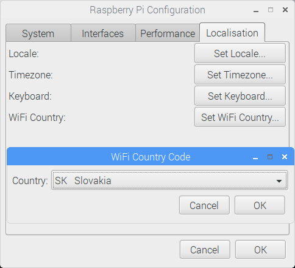
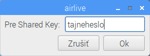

## Prehliadanie webu

Možno budete chcieť pripojiť svoje Raspberry Pi na internet. Ak ste počas inštalácie nepripojili ethernetový kábel alebo ste sa nepripojili na WiFi sieť, môžete sa pripojiť teraz.

+ Kliknite na ikonu s červenými krížikmi v pravom hornom rohu obrazovky a z rozbaľovacej ponuky vyberte svoju sieť. Možno sa budete potrebovať opýtať príslušnej zodpovednej osoby, ku ktorej sieti sa môžete pripojiť.

\--- collapse \---

* * *

## title: Set Wi-Fi Country

If you see the message "Set Wi-Fi Country on Localisation tab" when trying to connect to your Wi-Fi network:

+ Select **Preferences** and then **Raspberry Pi Configuration** from the menu.

+ Go to the **Localisation** tab.

+ Click the **Set WiFi Country** button.

+ Select your country from the list and click **OK**.

Po nastavení krajiny Wi-Fi sa môžete pripojiť k bezdrôtovej sieti.

\--- /collapse \---

+ Zadajte heslo pre prístup do vašej bezdrôrovej siete alebo o to poproste príslušnú zodpovednú osobu a následne kliknite na **OK**.

+ Keď sa vaše Pi pripojí do internetu, namiesto červených krížikov uvidíte symbol bezdrôtovej LAN siete.

+ Kliknite na ikonu webového prehliadača a vyhľadajte `raspberry pi`.

