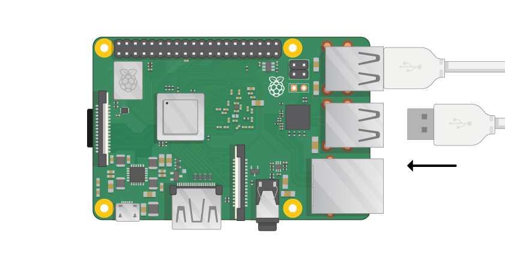

## Povežite svojo Raspberry Pi

Povežimo vašega Raspberry Pi in ga začnimo.

+ Preverite, ali vaš Raspberry Pi že ima SD-kartico v reži na spodnji strani, in če ne, vstavite kartico SD s programsko opremo Raspbian (prek NOOBS-a). Veliko kartic SD bo prišlo v večji adapter, in lahko kartico izvlečete iz tega s pomočjo ustnice na dnu.
    
    

[[[noobs-install]]]

+ Poiščite priključek USB za miško in povežite miško z enim od vrat USB na Raspberry Pi (ni pomembno, kateri je eden).
    
    

+ Enako povežite tipkovnico.
    
    

+ Poglej vrata HDMI na Raspberry Pi - obvestite, da ima veliko ravno stran na vrhu.
    
    

Poskrbite, da bo monitor priključen v vtičnico in vklopljen.

+ Kabel monitorja povežite s priključkom HDMI Pi - po potrebi uporabite adapter.

Nič še ne bo prikazano.

+ Povežite slušalke ali zvočnike z avdio priključkom, če jih imate.

+ Če ga imate, uporabite ethernetni kabel za priključitev ethernet portov na Raspberry Pi v ethernet vtičnico na steni ali na usmerjevalniku. (To vam ni treba storiti, če boste uporabljali brezžični LAN ali če se ne želite povezati z internetom.)

+ Upoštevajte, da ima priključek za mikro USB večjo ravno stran.

Priključite napajalnik v vtičnico in ga priključite na vtičnico mikro USB.

Na monitorju bi morali videti rdečo lučko na Raspberry Pi in maline.

Pi se bo zagnal v grafično namizje.

