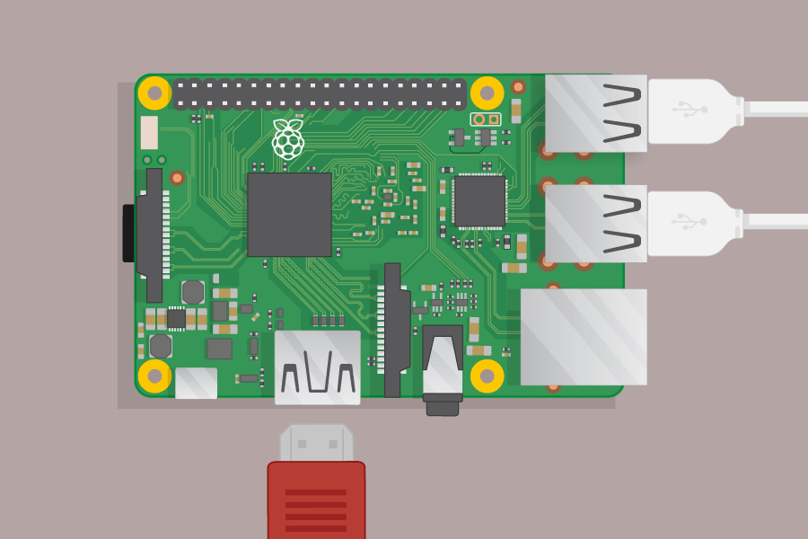

## Kết nối Raspberry Pi của bạn

Hãy kết nối Raspberry Pi của bạn và làm cho nó chạy.

+ Kiểm tra xem Raspberry Pi của bạn đã có thẻ SD trong khe ở mặt dưới chưa và nếu không, hãy lắp thẻ SD có cài đặt Raspbian (qua NOOBS). Rất nhiều thẻ SD sẽ đến bên trong một bộ chuyển đổi lớn hơn, và bạn có thể trượt thẻ ra khỏi điều này bằng cách sử dụng môi ở phía dưới.
    
    

[[[noobs-install]]]

+ Tìm đầu nối USB cho con chuột của bạn và kết nối chuột với một trong các cổng USB trên Raspberry Pi (không quan trọng cái nào).
    
    

+ Kết nối bàn phím theo cùng một cách.
    
    

+ Nhìn vào cổng HDMI trên Raspberry Pi - thông báo rằng nó có một mặt phẳng lớn trên đầu trang.
    
    

Đảm bảo màn hình của bạn được cắm vào ổ điện và bật.

+ Kết nối cáp màn hình với cổng HDMI của Pi - sử dụng bộ chuyển đổi nếu cần.

Không có gì sẽ hiển thị.

+ Kết nối tai nghe hoặc loa với giắc âm thanh nếu bạn có.

+ Nếu bạn có, hãy sử dụng cáp ethernet để kết nối cổng ethernet trên Raspberry Pi với ổ cắm ethernet trên tường hoặc trên bộ định tuyến của bạn. (Bạn không cần phải làm điều này nếu bạn đang sử dụng mạng LAN không dây hoặc nếu bạn không muốn kết nối với internet.)

+ Lưu ý rằng cổng nguồn micro USB có mặt phẳng dài hơn ở trên cùng.

Cắm nguồn điện vào ổ cắm và kết nối nó với cổng nguồn micro USB.

Bạn sẽ thấy một ánh sáng màu đỏ trên Raspberry Pi và quả mâm xôi trên màn hình.

Pi sẽ khởi động vào màn hình đồ họa.

