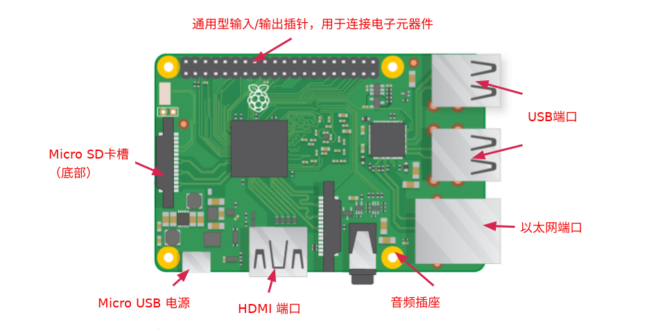

## 认识树莓派

我们来看看Raspberry Pi。 你应该在你面前有一台Raspberry Pi电脑。 它不应该连接到任何东西。

+ 看看你的树莓派。 你能找到图表上标出的所有东西吗？

+ **USB端口** - 这些端口用于连接鼠标和键盘。 您还可以连接其他组件，例如USB驱动器。

+ **SD卡插槽** - 您可以将SD卡插入此处。 这是操作系统软件和文件存储的地方。

+ **以太网端口** - 用于通过电缆将树莓派连接到网络。 树莓派还可以通过无线局域网连接到网络。

+ **音频插孔** - 您可以在此连接耳机或扬声器。

+ **HDMI端口** - 您正在连接用于显示Raspberry Pi输出的显示器（或投影仪）。 如果您的显示器有扬声器，您也可以使用它们听到声音。

+ **Micro USB电源连接器** - 这是连接电源的地方。 连接所有其他组件后，应该始终这样做。

+ **GPIO端口** - 这些端口允许您将电子组件（如LED和按钮）连接到Raspberry Pi。