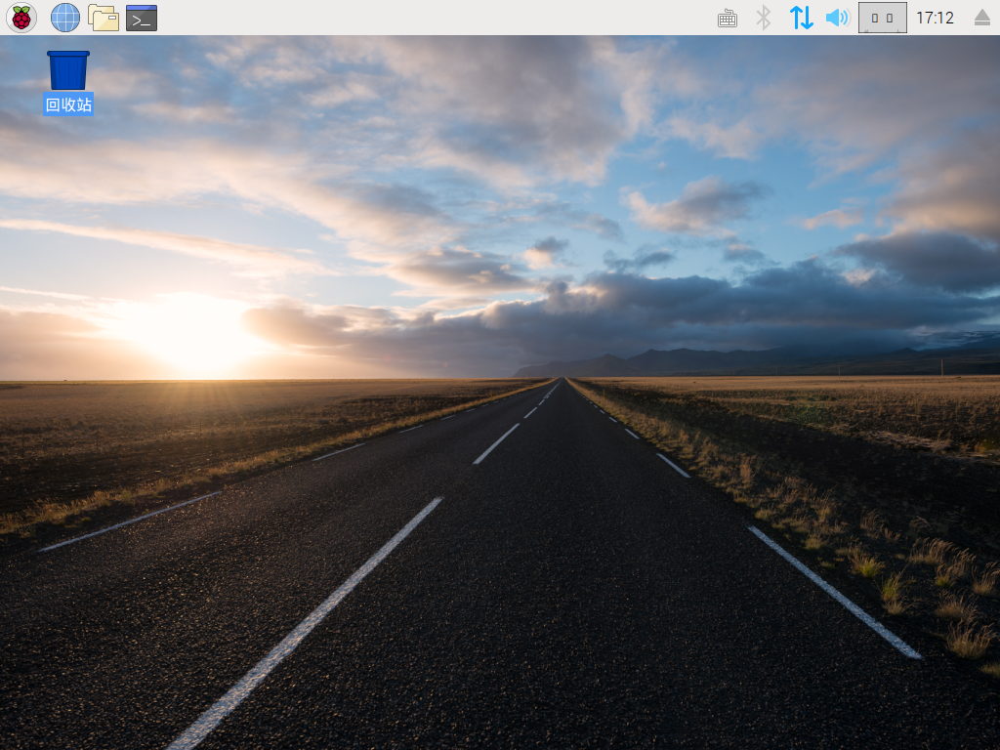

## 连接你的树莓派

让我们连接你的Raspberry Pi并让它运行。

+ 检查您的Raspberry Pi是否已在底部的插槽中安装了SD卡，如果没有，请插入安装了Raspbian（通过NOOBS）的SD卡。 很多SD卡都会插入一个较大的适配器内，您可以使用底部的唇部将卡滑出。
    
    

[[[noobs-install]]]

+ 找到鼠标的USB连接器，并将鼠标连接到Raspberry Pi上的其中一个USB端口（无论哪一个都没关系）。
    
    

+ 以相同的方式连接键盘。
    
    

+ 看看Raspberry Pi上的HDMI端口 - 注意它的顶部有一个大的平面。
    
    

确保您的显示器已插入墙上插座并打开。

+ 将显示器电缆连接到Pi的HDMI端口 - 必要时使用适配器。

这时还没有任何显示。

+ 如果您有耳机或扬声器，请将其连接至音频插孔。

+ 如果有，请使用以太网电缆将Raspberry Pi上的以太网端口连接到墙上或路由器上的以太网接口。 （如果您使用无线局域网，或者您不想连接到互联网，则无需这样做。）

+ 请注意，微型USB电源端口顶部有较长的平面。

将电源插入插座并将其连接到micro USB电源端口。

你应该看到树莓派上的红灯亮起和监视器上显示的树莓图案。

Pi将启动并进入到图形桌面。

