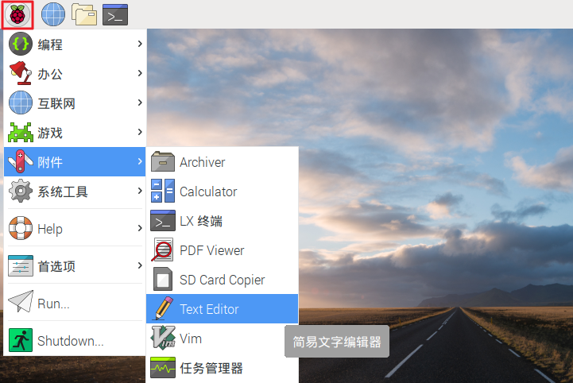
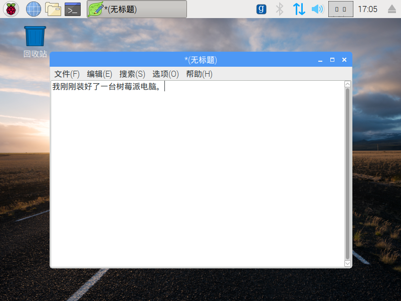
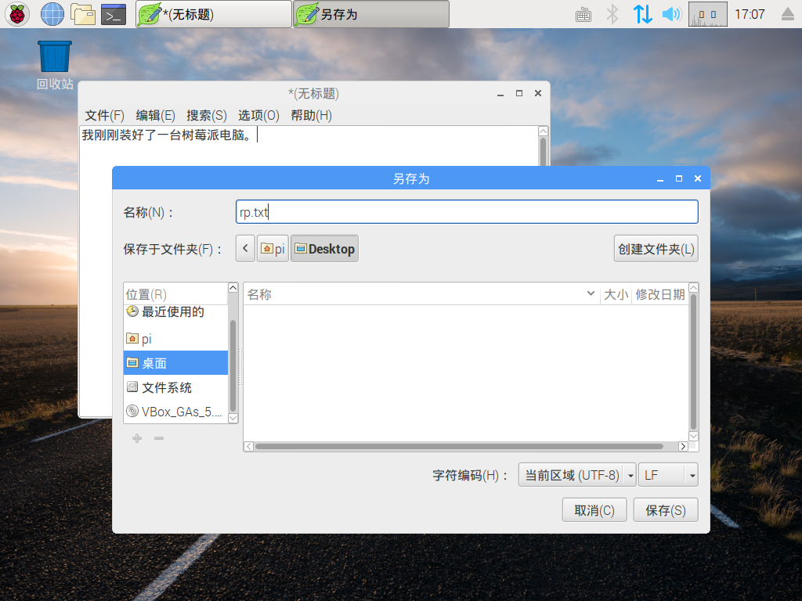
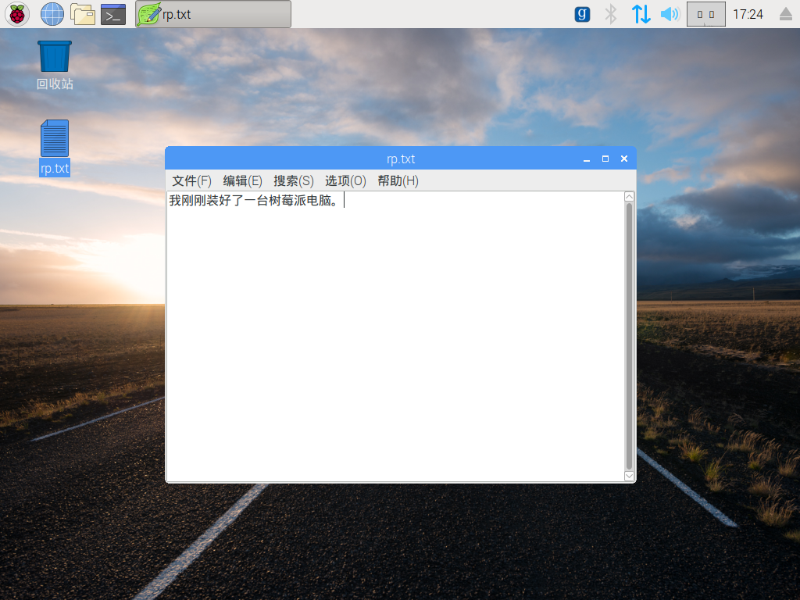
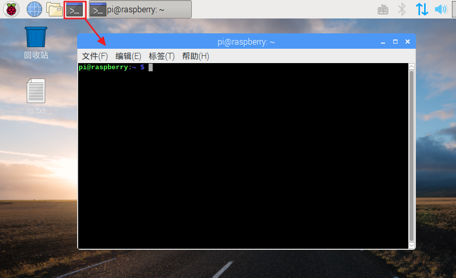
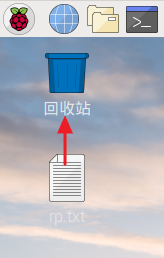

## 树莓派导览

现在是时候去浏览一下Raspberry Pi了。

+ 看到左上角的树莓了吗？ 这就是你访问菜单的地方：点击它，你会发现很多应用程序。

+ 点击 **附件** ，然后选择 **文本编辑器**。

+ 在弹出的窗口中键入 `我刚组装了一个Raspberry Pi`。

+ 单击 **文件**，然后选择 **保存**，然后单击 **桌面** 并将文件另存为 `rp.txt`。

+ 您应该看到名为 `rp.txt` 的图标出现在桌面上。

您的文件已保存到Raspberry Pi的SD卡上。

+ 单击窗口右上角的 **X** 关闭文本编辑器。

+ 返回到树莓菜单，选择 **关机**，然后选择 **重启**。

+ 当Pi重新启动后，你的文件应该仍然在那里。

+ Raspberry Pi运行一种称为Linux的操作系统（Windows和MacOS是其他操作系统）。 它允许你通过输入命令而不是点击菜单选项来实现。 点击屏幕顶部的 **终端**：

+ 在出现的窗口中，输入：

    ls
    

然后按下键盘的 <kbd>Enter</kbd>键。

这将列出 `主目录` 目录中的文件。

+ 现在，将此命令键入 **c**将 **d**目录更改为桌面：

    cd桌面
    

您必须在每个命令后按 <kbd>Enter</kbd> 键。

类型：

    LS
    

你能看到你创建的文件吗？

+ 点击 **X**关闭终端窗口。

+ 现在将 `rp.txt` 拖动到桌面上的废纸篓，以便Pi可以为下一个人准备好。
    
    