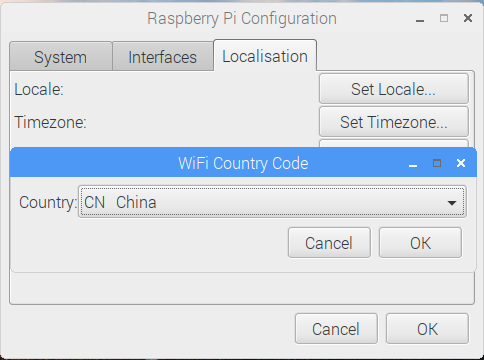

## 浏览网页

您可能想要将您的Raspberry Pi连接到互联网。 If you didn't plug in an ethernet cable or connect to a WiFi network during the setup, then you can connect now.

+ Click the icon with red crosses in the top right-hand corner of the screen, and select your network from the drop-down menu. You may need to ask an adult which network you should choose.

\--- collapse \---

* * *

## title: Set Wi-Fi Country

If you see the message "Set Wi-Fi Country on Localisation tab" when trying to connect to your Wi-Fi network:

+ Select **Preferences** and then **Raspberry Pi Configuration** from the menu.

+ Go to the **Localisation** tab.

+ Click the **Set WiFi Country** button.

+ Select your country from the list and click **OK**.

Once you Wi-Fi country is set, you can connect to a wireless network.

\--- /collapse \---

+ 输入您的无线网络密码，或要求成人为您输入密码，然后点击 **确定**。

+ 当您的Pi连接到互联网时，您将看到无线局域网符号，而不是红色叉叉。

+ 点击网页浏览器图标并搜索 `raspberry pi`。

